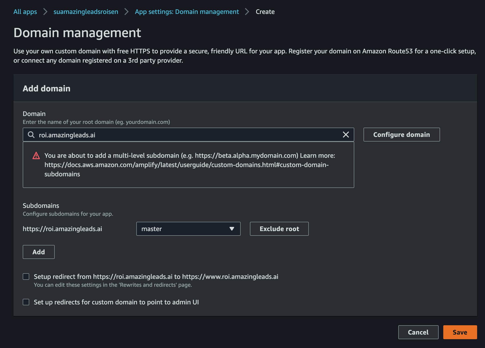

```sh
su-amazing-leads git:(development) ✗ amplify add api
? Please select from one of the below mentioned services: GraphQL
? Provide API name: suamleapi
? Choose the default authorization type for the API API key
? Enter a description for the API key: suamleapikey
? After how many days from now the API key should expire (1-365): 365
? Do you want to configure advanced settings for the GraphQL API Yes, I want to make some additional changes.
? Configure additional auth types? No
? Configure conflict detection? No
? Do you have an annotated GraphQL schema? No
? Do you want a guided schema creation? Yes
? What best describes your project: One-to-many relationship (e.g., “Blogs” with “Posts” and “Comments”)
? Do you want to edit the schema now? Yes
Please edit the file in your editor: /Users/robin8a/Documents/react_ws/su-amazing-leads/amplify/backend/api/suamleapi/schema.graphql
? Press enter to continue 

The following types do not have '@auth' enabled. Consider using @auth with @model
         - QuestionaryConfig
         - Questionary
         - Question
         - Option
         - Interaction
Learn more about @auth here: https://aws-amplify.github.io/docs/cli-toolchain/graphql#auth 


GraphQL schema compiled successfully.

Edit your schema at /Users/robin8a/Documents/react_ws/su-amazing-leads/amplify/backend/api/suamleapi/schema.graphql or place .graphql files in a directory at /Users/robin8a/Documents/react_ws/su-amazing-leads/amplify/backend/api/suamleapi/schema
Successfully added resource suamleapi locally

Some next steps:
"amplify push" will build all your local backend resources and provision it in the cloud
"amplify publish" will build all your local backend and frontend resources (if you have hosting category added) and provision it in the cloud

➜  su-amazing-leads git:(development) ✗ amplify push
✔ Successfully pulled backend environment suamaleapi from the cloud.

Current Environment: suamaleapi

| Category | Resource name  | Operation | Provider plugin   |
| -------- | -------------- | --------- | ----------------- |
| Api      | suamleapi      | Create    | awscloudformation |
| Hosting  | amplifyhosting | No Change |                   |
? Are you sure you want to continue? Yes

The following types do not have '@auth' enabled. Consider using @auth with @model
         - QuestionaryConfig
         - Questionary
         - Question
         - Option
         - Interaction
Learn more about @auth here: https://aws-amplify.github.io/docs/cli-toolchain/graphql#auth 


GraphQL schema compiled successfully.

Edit your schema at /Users/robin8a/Documents/react_ws/su-amazing-leads/amplify/backend/api/suamleapi/schema.graphql or place .graphql files in a directory at /Users/robin8a/Documents/react_ws/su-amazing-leads/amplify/backend/api/suamleapi/schema
? Do you want to generate code for your newly created GraphQL API Yes
? Choose the code generation language target javascript
? Enter the file name pattern of graphql queries, mutations and subscriptions src/graphql/**/*.js
? Do you want to generate/update all possible GraphQL operations - queries, mutations and subscriptions Yes
? Enter maximum statement depth [increase from default if your schema is deeply nested] 2
⠋ Updating resources in the cloud. This may take a few minutes...

CREATE_IN_PROGRESS apisuamleapi                              AWS::CloudFormation::Stack Thu Nov 05 2020 10:57:52 GMT-0500 (Colombia Standard Time)               
UPDATE_IN_PROGRESS amplify-su-amazing-leads-suamaleapi-92136 AWS::CloudFormation::Stack Thu Nov 05 2020 10:57:47 GMT-0500 (Colombia Standard Time) User Initiated
⠙ Updating resources in the cloud. This may take a few minutes...

CREATE_IN_PROGRESS apisuamleapi AWS::CloudFormation::Stack Thu Nov 05 2020 10:57:53 GMT-0500 (Colombia Standard Time) Resource creation Initiated
⠦ Updating resources in the cloud. This may take a few minutes...

CREATE_IN_PROGRESS amplify-su-amazing-leads-suamaleapi-92136-apisuamleapi-1HXH1K024XTRB AWS::CloudFormation::Stack Thu Nov 05 2020 10:57:53 GMT-0500 (Colombia Standard Time) User Initiated
⠸ Updating resources in the cloud. This may take a few minutes...

CREATE_COMPLETE    GraphQLAPI AWS::AppSync::GraphQLApi Thu Nov 05 2020 10:58:03 GMT-0500 (Colombia Standard Time)                            
CREATE_IN_PROGRESS GraphQLAPI AWS::AppSync::GraphQLApi Thu Nov 05 2020 10:58:02 GMT-0500 (Colombia Standard Time) Resource creation Initiated
CREATE_IN_PROGRESS GraphQLAPI AWS::AppSync::GraphQLApi Thu Nov 05 2020 10:58:00 GMT-0500 (Colombia Standard Time)                            
⠋ Updating resources in the cloud. This may take a few minutes...

CREATE_IN_PROGRESS GraphQLAPIKey AWS::AppSync::ApiKey        Thu Nov 05 2020 10:58:06 GMT-0500 (Colombia Standard Time) 
CREATE_IN_PROGRESS GraphQLSchema AWS::AppSync::GraphQLSchema Thu Nov 05 2020 10:58:06 GMT-0500 (Colombia Standard Time) 
⠋ Updating resources in the cloud. This may take a few minutes...

CREATE_IN_PROGRESS GraphQLSchema AWS::AppSync::GraphQLSchema Thu Nov 05 2020 10:58:08 GMT-0500 (Colombia Standard Time) Resource creation Initiated
⠸ Updating resources in the cloud. This may take a few minutes...

CREATE_IN_PROGRESS Questionary       AWS::CloudFormation::Stack  Thu Nov 05 2020 10:58:13 GMT-0500 (Colombia Standard Time) Resource creation Initiated
CREATE_IN_PROGRESS Interaction       AWS::CloudFormation::Stack  Thu Nov 05 2020 10:58:13 GMT-0500 (Colombia Standard Time) Resource creation Initiated
CREATE_IN_PROGRESS Question          AWS::CloudFormation::Stack  Thu Nov 05 2020 10:58:13 GMT-0500 (Colombia Standard Time) Resource creation Initiated
CREATE_IN_PROGRESS QuestionaryConfig AWS::CloudFormation::Stack  Thu Nov 05 2020 10:58:13 GMT-0500 (Colombia Standard Time) Resource creation Initiated
CREATE_IN_PROGRESS Option            AWS::CloudFormation::Stack  Thu Nov 05 2020 10:58:12 GMT-0500 (Colombia Standard Time)                            
CREATE_IN_PROGRESS Questionary       AWS::CloudFormation::Stack  Thu Nov 05 2020 10:58:12 GMT-0500 (Colombia Standard Time)                            
CREATE_IN_PROGRESS Interaction       AWS::CloudFormation::Stack  Thu Nov 05 2020 10:58:12 GMT-0500 (Colombia Standard Time)                            
CREATE_IN_PROGRESS Question          AWS::CloudFormation::Stack  Thu Nov 05 2020 10:58:12 GMT-0500 (Colombia Standard Time)                            
CREATE_IN_PROGRESS QuestionaryConfig AWS::CloudFormation::Stack  Thu Nov 05 2020 10:58:12 GMT-0500 (Colombia Standard Time)                            
CREATE_COMPLETE    GraphQLSchema     AWS::AppSync::GraphQLSchema Thu Nov 05 2020 10:58:09 GMT-0500 (Colombia Standard Time)                            
⠇ Updating resources in the cloud. This may take a few minutes...

CREATE_IN_PROGRESS amplify-su-amazing-leads-suamaleapi-92136-apisuamleapi-1HXH1K024XTRB-Questionary-TTMTRK36TX2V AWS::CloudFormation::Stack Thu Nov 05 2020 10:58:13 GMT-0500 (Colombia Standard Time) User Initiated
⠏ Updating resources in the cloud. This may take a few minutes...

CREATE_IN_PROGRESS amplify-su-amazing-leads-suamaleapi-92136-apisuamleapi-1HXH1K024XTRB-Interaction-XO03UQGMK52C AWS::CloudFormation::Stack Thu Nov 05 2020 10:58:13 GMT-0500 (Colombia Standard Time) User Initiated
⠋ Updating resources in the cloud. This may take a few minutes...

CREATE_IN_PROGRESS amplify-su-amazing-leads-suamaleapi-92136-apisuamleapi-1HXH1K024XTRB-Question-1X5FY9JGH7Y1F AWS::CloudFormation::Stack Thu Nov 05 2020 10:58:13 GMT-0500 (Colombia Standard Time) User Initiated
⠙ Updating resources in the cloud. This may take a few minutes...

CREATE_IN_PROGRESS amplify-su-amazing-leads-suamaleapi-92136-apisuamleapi-1HXH1K024XTRB-QuestionaryConfig-1UKVAV4RN0G57 AWS::CloudFormation::Stack Thu Nov 05 2020 10:58:13 GMT-0500 (Colombia Standard Time) User Initiated
⠼ Updating resources in the cloud. This may take a few minutes...

CREATE_IN_PROGRESS Option AWS::CloudFormation::Stack Thu Nov 05 2020 10:58:13 GMT-0500 (Colombia Standard Time) Resource creation Initiated
⠏ Updating resources in the cloud. This may take a few minutes...

CREATE_IN_PROGRESS amplify-su-amazing-leads-suamaleapi-92136-apisuamleapi-1HXH1K024XTRB-Option-F3VIAZ9UPXXU AWS::CloudFormation::Stack Thu Nov 05 2020 10:58:13 GMT-0500 (Colombia Standard Time) User Initiated
⠇ Updating resources in the cloud. This may take a few minutes...

CREATE_COMPLETE    GraphQLAPIKey AWS::AppSync::ApiKey Thu Nov 05 2020 10:58:19 GMT-0500 (Colombia Standard Time)                            
CREATE_IN_PROGRESS GraphQLAPIKey AWS::AppSync::ApiKey Thu Nov 05 2020 10:58:19 GMT-0500 (Colombia Standard Time) Resource creation Initiated
⠹ Updating resources in the cloud. This may take a few minutes...

CREATE_IN_PROGRESS InteractionIAMRole AWS::IAM::Role       Thu Nov 05 2020 10:58:21 GMT-0500 (Colombia Standard Time) 
CREATE_IN_PROGRESS InteractionTable   AWS::DynamoDB::Table Thu Nov 05 2020 10:58:21 GMT-0500 (Colombia Standard Time) 


CREATE_IN_PROGRESS QuestionTable   AWS::DynamoDB::Table Thu Nov 05 2020 10:58:21 GMT-0500 (Colombia Standard Time) Resource creation Initiated
CREATE_IN_PROGRESS QuestionIAMRole AWS::IAM::Role       Thu Nov 05 2020 10:58:20 GMT-0500 (Colombia Standard Time) Resource creation Initiated
CREATE_IN_PROGRESS QuestionTable   AWS::DynamoDB::Table Thu Nov 05 2020 10:58:20 GMT-0500 (Colombia Standard Time)                            
CREATE_IN_PROGRESS QuestionIAMRole AWS::IAM::Role       Thu Nov 05 2020 10:58:20 GMT-0500 (Colombia Standard Time)                            
⠦ Updating resources in the cloud. This may take a few minutes...

CREATE_IN_PROGRESS QuestionaryConfigTable   AWS::DynamoDB::Table Thu Nov 05 2020 10:58:21 GMT-0500 (Colombia Standard Time) Resource creation Initiated
CREATE_IN_PROGRESS QuestionaryConfigIAMRole AWS::IAM::Role       Thu Nov 05 2020 10:58:21 GMT-0500 (Colombia Standard Time) Resource creation Initiated
CREATE_IN_PROGRESS QuestionaryConfigIAMRole AWS::IAM::Role       Thu Nov 05 2020 10:58:20 GMT-0500 (Colombia Standard Time)                            
CREATE_IN_PROGRESS QuestionaryConfigTable   AWS::DynamoDB::Table Thu Nov 05 2020 10:58:20 GMT-0500 (Colombia Standard Time)                            
⠼ Updating resources in the cloud. This may take a few minutes...

CREATE_IN_PROGRESS OptionTable   AWS::DynamoDB::Table Thu Nov 05 2020 10:58:21 GMT-0500 (Colombia Standard Time) Resource creation Initiated
CREATE_IN_PROGRESS OptionIAMRole AWS::IAM::Role       Thu Nov 05 2020 10:58:21 GMT-0500 (Colombia Standard Time) Resource creation Initiated
CREATE_IN_PROGRESS OptionTable   AWS::DynamoDB::Table Thu Nov 05 2020 10:58:21 GMT-0500 (Colombia Standard Time)                            
CREATE_IN_PROGRESS OptionIAMRole AWS::IAM::Role       Thu Nov 05 2020 10:58:20 GMT-0500 (Colombia Standard Time)                            
⠴ Updating resources in the cloud. This may take a few minutes...

CREATE_IN_PROGRESS QuestionaryTable   AWS::DynamoDB::Table Thu Nov 05 2020 10:58:23 GMT-0500 (Colombia Standard Time) Resource creation Initiated
CREATE_IN_PROGRESS QuestionaryTable   AWS::DynamoDB::Table Thu Nov 05 2020 10:58:23 GMT-0500 (Colombia Standard Time)                            
CREATE_IN_PROGRESS QuestionaryIAMRole AWS::IAM::Role       Thu Nov 05 2020 10:58:21 GMT-0500 (Colombia Standard Time) Resource creation Initiated
CREATE_IN_PROGRESS QuestionaryIAMRole AWS::IAM::Role       Thu Nov 05 2020 10:58:21 GMT-0500 (Colombia Standard Time)                            
⠇ Updating resources in the cloud. This may take a few minutes...

CREATE_IN_PROGRESS InteractionIAMRole AWS::IAM::Role       Thu Nov 05 2020 10:58:21 GMT-0500 (Colombia Standard Time) Resource creation Initiated
CREATE_IN_PROGRESS InteractionTable   AWS::DynamoDB::Table Thu Nov 05 2020 10:58:21 GMT-0500 (Colombia Standard Time) Resource creation Initiated
⠼ Updating resources in the cloud. This may take a few minutes...

CREATE_COMPLETE QuestionaryConfigIAMRole AWS::IAM::Role Thu Nov 05 2020 10:58:35 GMT-0500 (Colombia Standard Time) 
⠏ Updating resources in the cloud. This may take a few minutes...

CREATE_IN_PROGRESS OptionDataSource AWS::AppSync::DataSource Thu Nov 05 2020 10:58:38 GMT-0500 (Colombia Standard Time) 
CREATE_COMPLETE    OptionIAMRole    AWS::IAM::Role           Thu Nov 05 2020 10:58:35 GMT-0500 (Colombia Standard Time) 
⠋ Updating resources in the cloud. This may take a few minutes...

CREATE_IN_PROGRESS QuestionaryDataSource AWS::AppSync::DataSource Thu Nov 05 2020 10:58:38 GMT-0500 (Colombia Standard Time) 
CREATE_COMPLETE    QuestionaryIAMRole    AWS::IAM::Role           Thu Nov 05 2020 10:58:35 GMT-0500 (Colombia Standard Time) 
⠙ Updating resources in the cloud. This may take a few minutes...

CREATE_IN_PROGRESS InteractionDataSource AWS::AppSync::DataSource Thu Nov 05 2020 10:58:38 GMT-0500 (Colombia Standard Time) 
CREATE_COMPLETE    InteractionIAMRole    AWS::IAM::Role           Thu Nov 05 2020 10:58:35 GMT-0500 (Colombia Standard Time) 
⠹ Updating resources in the cloud. This may take a few minutes...

CREATE_IN_PROGRESS QuestionDataSource AWS::AppSync::DataSource Thu Nov 05 2020 10:58:38 GMT-0500 (Colombia Standard Time) 
CREATE_COMPLETE    QuestionIAMRole    AWS::IAM::Role           Thu Nov 05 2020 10:58:35 GMT-0500 (Colombia Standard Time) 
⠏ Updating resources in the cloud. This may take a few minutes...

CREATE_IN_PROGRESS QuestionaryConfigDataSource AWS::AppSync::DataSource Thu Nov 05 2020 10:58:38 GMT-0500 (Colombia Standard Time) 
⠹ Updating resources in the cloud. This may take a few minutes...

CREATE_COMPLETE    OptionDataSource AWS::AppSync::DataSource Thu Nov 05 2020 10:58:40 GMT-0500 (Colombia Standard Time)                            
CREATE_IN_PROGRESS OptionDataSource AWS::AppSync::DataSource Thu Nov 05 2020 10:58:40 GMT-0500 (Colombia Standard Time) Resource creation Initiated
⠴ Updating resources in the cloud. This may take a few minutes...

CREATE_COMPLETE    InteractionDataSource AWS::AppSync::DataSource Thu Nov 05 2020 10:58:41 GMT-0500 (Colombia Standard Time)                            
CREATE_IN_PROGRESS InteractionDataSource AWS::AppSync::DataSource Thu Nov 05 2020 10:58:40 GMT-0500 (Colombia Standard Time) Resource creation Initiated
⠇ Updating resources in the cloud. This may take a few minutes...

CREATE_COMPLETE    QuestionaryConfigDataSource AWS::AppSync::DataSource Thu Nov 05 2020 10:58:41 GMT-0500 (Colombia Standard Time)                            
CREATE_IN_PROGRESS QuestionaryConfigDataSource AWS::AppSync::DataSource Thu Nov 05 2020 10:58:40 GMT-0500 (Colombia Standard Time) Resource creation Initiated
⠏ Updating resources in the cloud. This may take a few minutes...

CREATE_COMPLETE    QuestionaryDataSource AWS::AppSync::DataSource Thu Nov 05 2020 10:58:40 GMT-0500 (Colombia Standard Time)                            
CREATE_IN_PROGRESS QuestionaryDataSource AWS::AppSync::DataSource Thu Nov 05 2020 10:58:40 GMT-0500 (Colombia Standard Time) Resource creation Initiated
⠹ Updating resources in the cloud. This may take a few minutes...

CREATE_COMPLETE    QuestionDataSource AWS::AppSync::DataSource Thu Nov 05 2020 10:58:40 GMT-0500 (Colombia Standard Time)                            
CREATE_IN_PROGRESS QuestionDataSource AWS::AppSync::DataSource Thu Nov 05 2020 10:58:40 GMT-0500 (Colombia Standard Time) Resource creation Initiated
⠸ Updating resources in the cloud. This may take a few minutes...

CREATE_IN_PROGRESS CreateOptionResolver AWS::AppSync::Resolver Thu Nov 05 2020 10:58:45 GMT-0500 (Colombia Standard Time) Resource creation Initiated
CREATE_IN_PROGRESS DeleteOptionResolver AWS::AppSync::Resolver Thu Nov 05 2020 10:58:43 GMT-0500 (Colombia Standard Time)                            
CREATE_IN_PROGRESS UpdateOptionResolver AWS::AppSync::Resolver Thu Nov 05 2020 10:58:43 GMT-0500 (Colombia Standard Time)                            
CREATE_IN_PROGRESS CreateOptionResolver AWS::AppSync::Resolver Thu Nov 05 2020 10:58:43 GMT-0500 (Colombia Standard Time)                            
CREATE_IN_PROGRESS ListOptionResolver   AWS::AppSync::Resolver Thu Nov 05 2020 10:58:43 GMT-0500 (Colombia Standard Time)                            
CREATE_IN_PROGRESS GetOptionResolver    AWS::AppSync::Resolver Thu Nov 05 2020 10:58:42 GMT-0500 (Colombia Standard Time)                            
⠴ Updating resources in the cloud. This may take a few minutes...

CREATE_IN_PROGRESS CreateQuestionaryResolver AWS::AppSync::Resolver Thu Nov 05 2020 10:58:44 GMT-0500 (Colombia Standard Time) 
CREATE_IN_PROGRESS DeleteQuestionaryResolver AWS::AppSync::Resolver Thu Nov 05 2020 10:58:44 GMT-0500 (Colombia Standard Time) 
CREATE_IN_PROGRESS ListQuestionaryResolver   AWS::AppSync::Resolver Thu Nov 05 2020 10:58:44 GMT-0500 (Colombia Standard Time) 
CREATE_IN_PROGRESS UpdateQuestionaryResolver AWS::AppSync::Resolver Thu Nov 05 2020 10:58:44 GMT-0500 (Colombia Standard Time) 
CREATE_IN_PROGRESS GetQuestionaryResolver    AWS::AppSync::Resolver Thu Nov 05 2020 10:58:43 GMT-0500 (Colombia Standard Time) 
⠦ Updating resources in the cloud. This may take a few minutes...

CREATE_IN_PROGRESS GetInteractionResolver    AWS::AppSync::Resolver Thu Nov 05 2020 10:58:44 GMT-0500 (Colombia Standard Time) 
CREATE_IN_PROGRESS ListInteractionResolver   AWS::AppSync::Resolver Thu Nov 05 2020 10:58:44 GMT-0500 (Colombia Standard Time) 
CREATE_IN_PROGRESS CreateInteractionResolver AWS::AppSync::Resolver Thu Nov 05 2020 10:58:43 GMT-0500 (Colombia Standard Time) 
CREATE_IN_PROGRESS DeleteInteractionResolver AWS::AppSync::Resolver Thu Nov 05 2020 10:58:43 GMT-0500 (Colombia Standard Time) 
CREATE_IN_PROGRESS UpdateInteractionResolver AWS::AppSync::Resolver Thu Nov 05 2020 10:58:43 GMT-0500 (Colombia Standard Time) 
⠙ Updating resources in the cloud. This may take a few minutes...

CREATE_COMPLETE    UpdateOptionResolver AWS::AppSync::Resolver Thu Nov 05 2020 10:58:45 GMT-0500 (Colombia Standard Time)                            
CREATE_IN_PROGRESS UpdateOptionResolver AWS::AppSync::Resolver Thu Nov 05 2020 10:58:45 GMT-0500 (Colombia Standard Time) Resource creation Initiated
CREATE_COMPLETE    CreateOptionResolver AWS::AppSync::Resolver Thu Nov 05 2020 10:58:45 GMT-0500 (Colombia Standard Time)                            
⠦ Updating resources in the cloud. This may take a few minutes...

CREATE_IN_PROGRESS CreateQuestionResolver AWS::AppSync::Resolver Thu Nov 05 2020 10:58:46 GMT-0500 (Colombia Standard Time) Resource creation Initiated
CREATE_COMPLETE    GetQuestionResolver    AWS::AppSync::Resolver Thu Nov 05 2020 10:58:46 GMT-0500 (Colombia Standard Time)                            
CREATE_IN_PROGRESS DeleteQuestionResolver AWS::AppSync::Resolver Thu Nov 05 2020 10:58:45 GMT-0500 (Colombia Standard Time) Resource creation Initiated
CREATE_IN_PROGRESS GetQuestionResolver    AWS::AppSync::Resolver Thu Nov 05 2020 10:58:45 GMT-0500 (Colombia Standard Time) Resource creation Initiated
CREATE_COMPLETE    UpdateQuestionResolver AWS::AppSync::Resolver Thu Nov 05 2020 10:58:45 GMT-0500 (Colombia Standard Time)                            
CREATE_IN_PROGRESS UpdateQuestionResolver AWS::AppSync::Resolver Thu Nov 05 2020 10:58:45 GMT-0500 (Colombia Standard Time) Resource creation Initiated
CREATE_IN_PROGRESS GetQuestionResolver    AWS::AppSync::Resolver Thu Nov 05 2020 10:58:43 GMT-0500 (Colombia Standard Time)                            
CREATE_IN_PROGRESS DeleteQuestionResolver AWS::AppSync::Resolver Thu Nov 05 2020 10:58:43 GMT-0500 (Colombia Standard Time)                            
CREATE_IN_PROGRESS CreateQuestionResolver AWS::AppSync::Resolver Thu Nov 05 2020 10:58:43 GMT-0500 (Colombia Standard Time)                            
CREATE_IN_PROGRESS UpdateQuestionResolver AWS::AppSync::Resolver Thu Nov 05 2020 10:58:43 GMT-0500 (Colombia Standard Time)                            
CREATE_IN_PROGRESS ListQuestionResolver   AWS::AppSync::Resolver Thu Nov 05 2020 10:58:43 GMT-0500 (Colombia Standard Time)                            
⠇ Updating resources in the cloud. This may take a few minutes...

CREATE_COMPLETE CreateQuestionResolver AWS::AppSync::Resolver Thu Nov 05 2020 10:58:46 GMT-0500 (Colombia Standard Time) 
CREATE_COMPLETE DeleteQuestionResolver AWS::AppSync::Resolver Thu Nov 05 2020 10:58:46 GMT-0500 (Colombia Standard Time) 
⠋ Updating resources in the cloud. This may take a few minutes...

CREATE_COMPLETE    GetInteractionResolver    AWS::AppSync::Resolver Thu Nov 05 2020 10:58:46 GMT-0500 (Colombia Standard Time)                            
CREATE_COMPLETE    ListInteractionResolver   AWS::AppSync::Resolver Thu Nov 05 2020 10:58:46 GMT-0500 (Colombia Standard Time)                            
CREATE_IN_PROGRESS GetInteractionResolver    AWS::AppSync::Resolver Thu Nov 05 2020 10:58:46 GMT-0500 (Colombia Standard Time) Resource creation Initiated
CREATE_COMPLETE    CreateInteractionResolver AWS::AppSync::Resolver Thu Nov 05 2020 10:58:46 GMT-0500 (Colombia Standard Time)                            
CREATE_IN_PROGRESS ListInteractionResolver   AWS::AppSync::Resolver Thu Nov 05 2020 10:58:46 GMT-0500 (Colombia Standard Time) Resource creation Initiated
CREATE_IN_PROGRESS CreateInteractionResolver AWS::AppSync::Resolver Thu Nov 05 2020 10:58:45 GMT-0500 (Colombia Standard Time) Resource creation Initiated
CREATE_COMPLETE    UpdateInteractionResolver AWS::AppSync::Resolver Thu Nov 05 2020 10:58:45 GMT-0500 (Colombia Standard Time)                            
CREATE_IN_PROGRESS UpdateInteractionResolver AWS::AppSync::Resolver Thu Nov 05 2020 10:58:45 GMT-0500 (Colombia Standard Time) Resource creation Initiated
⠴ Updating resources in the cloud. This may take a few minutes...

CREATE_IN_PROGRESS UpdateQuestionaryConfigResolver AWS::AppSync::Resolver Thu Nov 05 2020 10:58:46 GMT-0500 (Colombia Standard Time) Resource creation Initiated
CREATE_COMPLETE    CreateQuestionaryConfigResolver AWS::AppSync::Resolver Thu Nov 05 2020 10:58:46 GMT-0500 (Colombia Standard Time)                            
CREATE_COMPLETE    ListQuestionaryConfigResolver   AWS::AppSync::Resolver Thu Nov 05 2020 10:58:46 GMT-0500 (Colombia Standard Time)                            
CREATE_IN_PROGRESS CreateQuestionaryConfigResolver AWS::AppSync::Resolver Thu Nov 05 2020 10:58:46 GMT-0500 (Colombia Standard Time) Resource creation Initiated
CREATE_IN_PROGRESS ListQuestionaryConfigResolver   AWS::AppSync::Resolver Thu Nov 05 2020 10:58:46 GMT-0500 (Colombia Standard Time) Resource creation Initiated
CREATE_COMPLETE    GetQuestionaryConfigResolver    AWS::AppSync::Resolver Thu Nov 05 2020 10:58:45 GMT-0500 (Colombia Standard Time)                            
CREATE_IN_PROGRESS GetQuestionaryConfigResolver    AWS::AppSync::Resolver Thu Nov 05 2020 10:58:45 GMT-0500 (Colombia Standard Time) Resource creation Initiated
CREATE_IN_PROGRESS ListQuestionaryConfigResolver   AWS::AppSync::Resolver Thu Nov 05 2020 10:58:44 GMT-0500 (Colombia Standard Time)                            
CREATE_IN_PROGRESS CreateQuestionaryConfigResolver AWS::AppSync::Resolver Thu Nov 05 2020 10:58:44 GMT-0500 (Colombia Standard Time)                            
CREATE_IN_PROGRESS UpdateQuestionaryConfigResolver AWS::AppSync::Resolver Thu Nov 05 2020 10:58:43 GMT-0500 (Colombia Standard Time)                            
CREATE_IN_PROGRESS GetQuestionaryConfigResolver    AWS::AppSync::Resolver Thu Nov 05 2020 10:58:43 GMT-0500 (Colombia Standard Time)                            
⠹ Updating resources in the cloud. This may take a few minutes...

CREATE_COMPLETE    DeleteQuestionaryResolver AWS::AppSync::Resolver Thu Nov 05 2020 10:58:47 GMT-0500 (Colombia Standard Time)                            
CREATE_COMPLETE    CreateQuestionaryResolver AWS::AppSync::Resolver Thu Nov 05 2020 10:58:47 GMT-0500 (Colombia Standard Time)                            
CREATE_IN_PROGRESS CreateQuestionaryResolver AWS::AppSync::Resolver Thu Nov 05 2020 10:58:46 GMT-0500 (Colombia Standard Time) Resource creation Initiated
CREATE_IN_PROGRESS DeleteQuestionaryResolver AWS::AppSync::Resolver Thu Nov 05 2020 10:58:46 GMT-0500 (Colombia Standard Time) Resource creation Initiated
CREATE_COMPLETE    ListQuestionaryResolver   AWS::AppSync::Resolver Thu Nov 05 2020 10:58:46 GMT-0500 (Colombia Standard Time)                            
CREATE_COMPLETE    UpdateQuestionaryResolver AWS::AppSync::Resolver Thu Nov 05 2020 10:58:46 GMT-0500 (Colombia Standard Time)                            
CREATE_IN_PROGRESS ListQuestionaryResolver   AWS::AppSync::Resolver Thu Nov 05 2020 10:58:46 GMT-0500 (Colombia Standard Time) Resource creation Initiated
CREATE_IN_PROGRESS UpdateQuestionaryResolver AWS::AppSync::Resolver Thu Nov 05 2020 10:58:46 GMT-0500 (Colombia Standard Time) Resource creation Initiated
CREATE_COMPLETE    GetQuestionaryResolver    AWS::AppSync::Resolver Thu Nov 05 2020 10:58:46 GMT-0500 (Colombia Standard Time)                            
CREATE_IN_PROGRESS GetQuestionaryResolver    AWS::AppSync::Resolver Thu Nov 05 2020 10:58:45 GMT-0500 (Colombia Standard Time) Resource creation Initiated
⠦ Updating resources in the cloud. This may take a few minutes...

CREATE_COMPLETE    GetOptionResolver    AWS::AppSync::Resolver Thu Nov 05 2020 10:58:46 GMT-0500 (Colombia Standard Time)                            
CREATE_COMPLETE    ListOptionResolver   AWS::AppSync::Resolver Thu Nov 05 2020 10:58:46 GMT-0500 (Colombia Standard Time)                            
CREATE_IN_PROGRESS GetOptionResolver    AWS::AppSync::Resolver Thu Nov 05 2020 10:58:46 GMT-0500 (Colombia Standard Time) Resource creation Initiated
CREATE_IN_PROGRESS ListOptionResolver   AWS::AppSync::Resolver Thu Nov 05 2020 10:58:46 GMT-0500 (Colombia Standard Time) Resource creation Initiated
CREATE_COMPLETE    DeleteOptionResolver AWS::AppSync::Resolver Thu Nov 05 2020 10:58:46 GMT-0500 (Colombia Standard Time)                            
CREATE_IN_PROGRESS DeleteOptionResolver AWS::AppSync::Resolver Thu Nov 05 2020 10:58:45 GMT-0500 (Colombia Standard Time) Resource creation Initiated
⠹ Updating resources in the cloud. This may take a few minutes...

CREATE_IN_PROGRESS DeleteQuestionaryConfigResolver AWS::AppSync::Resolver Thu Nov 05 2020 10:58:48 GMT-0500 (Colombia Standard Time) 
CREATE_COMPLETE    UpdateQuestionaryConfigResolver AWS::AppSync::Resolver Thu Nov 05 2020 10:58:47 GMT-0500 (Colombia Standard Time) 
⠸ Updating resources in the cloud. This may take a few minutes...

CREATE_COMPLETE    DeleteInteractionResolver AWS::AppSync::Resolver Thu Nov 05 2020 10:58:47 GMT-0500 (Colombia Standard Time)                            
CREATE_IN_PROGRESS DeleteInteractionResolver AWS::AppSync::Resolver Thu Nov 05 2020 10:58:46 GMT-0500 (Colombia Standard Time) Resource creation Initiated
⠴ Updating resources in the cloud. This may take a few minutes...

CREATE_COMPLETE    QuestionTable        AWS::DynamoDB::Table   Thu Nov 05 2020 10:58:51 GMT-0500 (Colombia Standard Time)                            
CREATE_COMPLETE    ListQuestionResolver AWS::AppSync::Resolver Thu Nov 05 2020 10:58:46 GMT-0500 (Colombia Standard Time)                            
CREATE_IN_PROGRESS ListQuestionResolver AWS::AppSync::Resolver Thu Nov 05 2020 10:58:46 GMT-0500 (Colombia Standard Time) Resource creation Initiated
⠋ Updating resources in the cloud. This may take a few minutes...

CREATE_COMPLETE OptionTable AWS::DynamoDB::Table Thu Nov 05 2020 10:58:52 GMT-0500 (Colombia Standard Time) 
⠋ Updating resources in the cloud. This may take a few minutes...

CREATE_COMPLETE    QuestionaryConfigTable          AWS::DynamoDB::Table   Thu Nov 05 2020 10:58:52 GMT-0500 (Colombia Standard Time)                            
CREATE_COMPLETE    DeleteQuestionaryConfigResolver AWS::AppSync::Resolver Thu Nov 05 2020 10:58:51 GMT-0500 (Colombia Standard Time)                            
CREATE_IN_PROGRESS DeleteQuestionaryConfigResolver AWS::AppSync::Resolver Thu Nov 05 2020 10:58:51 GMT-0500 (Colombia Standard Time) Resource creation Initiated
⠇ Updating resources in the cloud. This may take a few minutes...

CREATE_COMPLETE amplify-su-amazing-leads-suamaleapi-92136-apisuamleapi-1HXH1K024XTRB-QuestionaryConfig-1UKVAV4RN0G57 AWS::CloudFormation::Stack Thu Nov 05 2020 10:58:55 GMT-0500 (Colombia Standard Time) 
⠙ Updating resources in the cloud. This may take a few minutes...

CREATE_COMPLETE amplify-su-amazing-leads-suamaleapi-92136-apisuamleapi-1HXH1K024XTRB-Interaction-XO03UQGMK52C AWS::CloudFormation::Stack Thu Nov 05 2020 10:58:55 GMT-0500 (Colombia Standard Time) 
CREATE_COMPLETE InteractionTable                                                                              AWS::DynamoDB::Table       Thu Nov 05 2020 10:58:52 GMT-0500 (Colombia Standard Time) 
⠦ Updating resources in the cloud. This may take a few minutes...

CREATE_COMPLETE QuestionaryTable AWS::DynamoDB::Table Thu Nov 05 2020 10:58:54 GMT-0500 (Colombia Standard Time) 
⠋ Updating resources in the cloud. This may take a few minutes...

CREATE_COMPLETE amplify-su-amazing-leads-suamaleapi-92136-apisuamleapi-1HXH1K024XTRB-Option-F3VIAZ9UPXXU AWS::CloudFormation::Stack Thu Nov 05 2020 10:58:55 GMT-0500 (Colombia Standard Time) 
⠇ Updating resources in the cloud. This may take a few minutes...

CREATE_COMPLETE Question          AWS::CloudFormation::Stack Thu Nov 05 2020 10:59:00 GMT-0500 (Colombia Standard Time) 
CREATE_COMPLETE QuestionaryConfig AWS::CloudFormation::Stack Thu Nov 05 2020 10:59:00 GMT-0500 (Colombia Standard Time) 
⠴ Updating resources in the cloud. This may take a few minutes...

CREATE_COMPLETE amplify-su-amazing-leads-suamaleapi-92136-apisuamleapi-1HXH1K024XTRB-Questionary-TTMTRK36TX2V AWS::CloudFormation::Stack Thu Nov 05 2020 10:58:57 GMT-0500 (Colombia Standard Time) 
⠙ Updating resources in the cloud. This may take a few minutes...

CREATE_COMPLETE Option      AWS::CloudFormation::Stack Thu Nov 05 2020 10:59:01 GMT-0500 (Colombia Standard Time) 
CREATE_COMPLETE Questionary AWS::CloudFormation::Stack Thu Nov 05 2020 10:59:01 GMT-0500 (Colombia Standard Time) 
CREATE_COMPLETE Interaction AWS::CloudFormation::Stack Thu Nov 05 2020 10:59:01 GMT-0500 (Colombia Standard Time) 
⠙ Updating resources in the cloud. This may take a few minutes...

CREATE_IN_PROGRESS ConnectionStack AWS::CloudFormation::Stack Thu Nov 05 2020 10:59:06 GMT-0500 (Colombia Standard Time) Resource creation Initiated
CREATE_IN_PROGRESS ConnectionStack AWS::CloudFormation::Stack Thu Nov 05 2020 10:59:05 GMT-0500 (Colombia Standard Time)                            
⠦ Updating resources in the cloud. This may take a few minutes...

CREATE_IN_PROGRESS amplify-su-amazing-leads-suamaleapi-92136-apisuamleapi-1HXH1K024XTRB-ConnectionStack-ARY5KRID0L4 AWS::CloudFormation::Stack Thu Nov 05 2020 10:59:06 GMT-0500 (Colombia Standard Time) User Initiated
⠙ Updating resources in the cloud. This may take a few minutes...

CREATE_IN_PROGRESS QuestionaryquestionsResolver AWS::AppSync::Resolver Thu Nov 05 2020 10:59:12 GMT-0500 (Colombia Standard Time) 
CREATE_IN_PROGRESS QuestioninteractionsResolver AWS::AppSync::Resolver Thu Nov 05 2020 10:59:12 GMT-0500 (Colombia Standard Time) 
CREATE_IN_PROGRESS OptionquestionResolver       AWS::AppSync::Resolver Thu Nov 05 2020 10:59:12 GMT-0500 (Colombia Standard Time) 
CREATE_IN_PROGRESS InteractionquestionResolver  AWS::AppSync::Resolver Thu Nov 05 2020 10:59:12 GMT-0500 (Colombia Standard Time) 
CREATE_IN_PROGRESS QuestionoptionsResolver      AWS::AppSync::Resolver Thu Nov 05 2020 10:59:12 GMT-0500 (Colombia Standard Time) 
CREATE_IN_PROGRESS QuestionquestionaryResolver  AWS::AppSync::Resolver Thu Nov 05 2020 10:59:11 GMT-0500 (Colombia Standard Time) 
⠼ Updating resources in the cloud. This may take a few minutes...

CREATE_COMPLETE    QuestionaryquestionsResolver AWS::AppSync::Resolver Thu Nov 05 2020 10:59:14 GMT-0500 (Colombia Standard Time)                            
CREATE_IN_PROGRESS QuestionaryquestionsResolver AWS::AppSync::Resolver Thu Nov 05 2020 10:59:14 GMT-0500 (Colombia Standard Time) Resource creation Initiated
CREATE_COMPLETE    QuestioninteractionsResolver AWS::AppSync::Resolver Thu Nov 05 2020 10:59:14 GMT-0500 (Colombia Standard Time)                            
CREATE_COMPLETE    InteractionquestionResolver  AWS::AppSync::Resolver Thu Nov 05 2020 10:59:14 GMT-0500 (Colombia Standard Time)                            
CREATE_COMPLETE    OptionquestionResolver       AWS::AppSync::Resolver Thu Nov 05 2020 10:59:14 GMT-0500 (Colombia Standard Time)                            
CREATE_IN_PROGRESS OptionquestionResolver       AWS::AppSync::Resolver Thu Nov 05 2020 10:59:14 GMT-0500 (Colombia Standard Time) Resource creation Initiated
CREATE_IN_PROGRESS QuestioninteractionsResolver AWS::AppSync::Resolver Thu Nov 05 2020 10:59:14 GMT-0500 (Colombia Standard Time) Resource creation Initiated
CREATE_IN_PROGRESS InteractionquestionResolver  AWS::AppSync::Resolver Thu Nov 05 2020 10:59:14 GMT-0500 (Colombia Standard Time) Resource creation Initiated
CREATE_COMPLETE    QuestionquestionaryResolver  AWS::AppSync::Resolver Thu Nov 05 2020 10:59:14 GMT-0500 (Colombia Standard Time)                            
CREATE_IN_PROGRESS QuestionquestionaryResolver  AWS::AppSync::Resolver Thu Nov 05 2020 10:59:14 GMT-0500 (Colombia Standard Time) Resource creation Initiated
⠏ Updating resources in the cloud. This may take a few minutes...

CREATE_COMPLETE ConnectionStack AWS::CloudFormation::Stack Thu Nov 05 2020 10:59:17 GMT-0500 (Colombia Standard Time) 
⠧ Updating resources in the cloud. This may take a few minutes...

CREATE_IN_PROGRESS CustomResourcesjson AWS::CloudFormation::Stack Thu Nov 05 2020 10:59:21 GMT-0500 (Colombia Standard Time) Resource creation Initiated
CREATE_IN_PROGRESS CustomResourcesjson AWS::CloudFormation::Stack Thu Nov 05 2020 10:59:20 GMT-0500 (Colombia Standard Time)                            
⠼ Updating resources in the cloud. This may take a few minutes...

CREATE_IN_PROGRESS amplify-su-amazing-leads-suamaleapi-92136-apisuamleapi-1HXH1K024XT-CustomResourcesjson-154ZG6NU3YO7 AWS::CloudFormation::Stack Thu Nov 05 2020 10:59:21 GMT-0500 (Colombia Standard Time) User Initiated
⠙ Updating resources in the cloud. This may take a few minutes...

CREATE_COMPLETE amplify-su-amazing-leads-suamaleapi-92136-apisuamleapi-1HXH1K024XT-CustomResourcesjson-154ZG6NU3YO7 AWS::CloudFormation::Stack Thu Nov 05 2020 10:59:25 GMT-0500 (Colombia Standard Time) 
⠸ Updating resources in the cloud. This may take a few minutes...

CREATE_COMPLETE CustomResourcesjson AWS::CloudFormation::Stack Thu Nov 05 2020 10:59:32 GMT-0500 (Colombia Standard Time) 
⠇ Updating resources in the cloud. This may take a few minutes...

CREATE_COMPLETE amplify-su-amazing-leads-suamaleapi-92136-apisuamleapi-1HXH1K024XTRB AWS::CloudFormation::Stack Thu Nov 05 2020 10:59:35 GMT-0500 (Colombia Standard Time) 
⠧ Updating resources in the cloud. This may take a few minutes...

CREATE_COMPLETE apisuamleapi AWS::CloudFormation::Stack Thu Nov 05 2020 10:59:48 GMT-0500 (Colombia Standard Time) 
⠙ Updating resources in the cloud. This may take a few minutes...

UPDATE_COMPLETE                     amplify-su-amazing-leads-suamaleapi-92136 AWS::CloudFormation::Stack Thu Nov 05 2020 10:59:51 GMT-0500 (Colombia Standard Time) 
UPDATE_COMPLETE_CLEANUP_IN_PROGRESS amplify-su-amazing-leads-suamaleapi-92136 AWS::CloudFormation::Stack Thu Nov 05 2020 10:59:51 GMT-0500 (Colombia Standard Time) 
✔ Generated GraphQL operations successfully and saved at src/graphql
✔ All resources are updated in the cloud

GraphQL endpoint: https://rop52fode5aqfnb4cfyd2okbza.appsync-api.us-east-1.amazonaws.com/graphql
GraphQL API KEY: da2-qcf5cgzum5azjfokj2rgsafh2y


```


```
amplify push

Current Environment: suamaleapi

| Category | Resource name          | Operation | Provider plugin   |
| -------- | ---------------------- | --------- | ----------------- |
| Auth     | suamazingleads654e3021 | Create    | awscloudformation |
| Api      | suamleapi              | Create    | awscloudformation |
| Hosting  | amplifyhosting         | No Change |                   |
? Are you sure you want to continue? Yes

The following types do not have '@auth' enabled. Consider using @auth with @model
         - QuestionaryConfig
         - Questionary
         - Question
         - Option
         - Interaction
Learn more about @auth here: https://aws-amplify.github.io/docs/cli-toolchain/graphql#auth 


GraphQL schema compiled successfully.

Edit your schema at /Users/robin8a/Documents/react_ws/su-amazing-leads/amplify/backend/api/suamleapi/schema.graphql or place .graphql files in a directory at /Users/robin8a/Documents/react_ws/su-amazing-leads/amplify/backend/api/suamleapi/schema
? Do you want to generate code for your newly created GraphQL API Yes
? Choose the code generation language target javascript
? Enter the file name pattern of graphql queries, mutations and subscriptions src/graphq
l/**/*.js
? Do you want to generate/update all possible GraphQL operations - queries, mutations an
d subscriptions Yes
? Enter maximum statement depth [increase from default if your schema is deeply nested] 
2
⠙ Updating resources in the cloud. This may take a few minutes...

CREATE_IN_PROGRESS authsuamazingleads654e3021                AWS::CloudFormation::Stack Thu Nov 05 2020 07:03:53 GMT-0500 (Colombia Standard Time)               
CREATE_IN_PROGRESS UpdateRolesWithIDPFunctionRole            AWS::IAM::Role             Thu Nov 05 2020 07:03:53 GMT-0500 (Colombia Standard Time)               
UPDATE_IN_PROGRESS amplify-su-amazing-leads-suamaleapi-92136 AWS::CloudFormation::Stack Thu Nov 05 2020 07:03:48 GMT-0500 (Colombia Standard Time) User Initiated
⠹ Updating resources in the cloud. This may take a few minutes...

CREATE_IN_PROGRESS authsuamazingleads654e3021     AWS::CloudFormation::Stack Thu Nov 05 2020 07:03:54 GMT-0500 (Colombia Standard Time) Resource creation Initiated
CREATE_IN_PROGRESS UpdateRolesWithIDPFunctionRole AWS::IAM::Role             Thu Nov 05 2020 07:03:53 GMT-0500 (Colombia Standard Time) Resource creation Initiated
⠧ Updating resources in the cloud. This may take a few minutes...

CREATE_IN_PROGRESS amplify-su-amazing-leads-suamaleapi-92136-authsuamazingleads654e3021-1IBE6RRZXY1JO AWS::CloudFormation::Stack Thu Nov 05 2020 07:03:54 GMT-0500 (Colombia Standard Time) User Initiated
⠇ Updating resources in the cloud. This may take a few minutes...

CREATE_IN_PROGRESS SNSRole AWS::IAM::Role Thu Nov 05 2020 07:04:01 GMT-0500 (Colombia Standard Time) Resource creation Initiated
CREATE_IN_PROGRESS SNSRole AWS::IAM::Role Thu Nov 05 2020 07:04:00 GMT-0500 (Colombia Standard Time)                            
⠦ Updating resources in the cloud. This may take a few minutes...

CREATE_COMPLETE UpdateRolesWithIDPFunctionRole AWS::IAM::Role Thu Nov 05 2020 07:04:09 GMT-0500 (Colombia Standard Time) 
⠹ Updating resources in the cloud. This may take a few minutes...

CREATE_COMPLETE SNSRole AWS::IAM::Role Thu Nov 05 2020 07:04:17 GMT-0500 (Colombia Standard Time) 
⠼ Updating resources in the cloud. This may take a few minutes...

CREATE_IN_PROGRESS UserPool AWS::Cognito::UserPool Thu Nov 05 2020 07:04:23 GMT-0500 (Colombia Standard Time) Resource creation Initiated
CREATE_IN_PROGRESS UserPool AWS::Cognito::UserPool Thu Nov 05 2020 07:04:21 GMT-0500 (Colombia Standard Time)                            
⠙ Updating resources in the cloud. This may take a few minutes...

CREATE_COMPLETE UserPool AWS::Cognito::UserPool Thu Nov 05 2020 07:04:24 GMT-0500 (Colombia Standard Time) 
⠴ Updating resources in the cloud. This may take a few minutes...

CREATE_IN_PROGRESS UserPoolClient    AWS::Cognito::UserPoolClient Thu Nov 05 2020 07:04:27 GMT-0500 (Colombia Standard Time) 
CREATE_IN_PROGRESS UserPoolClientWeb AWS::Cognito::UserPoolClient Thu Nov 05 2020 07:04:27 GMT-0500 (Colombia Standard Time) 
⠸ Updating resources in the cloud. This may take a few minutes...

CREATE_COMPLETE    UserPoolClient    AWS::Cognito::UserPoolClient Thu Nov 05 2020 07:04:29 GMT-0500 (Colombia Standard Time)                            
CREATE_COMPLETE    UserPoolClientWeb AWS::Cognito::UserPoolClient Thu Nov 05 2020 07:04:29 GMT-0500 (Colombia Standard Time)                            
CREATE_IN_PROGRESS UserPoolClient    AWS::Cognito::UserPoolClient Thu Nov 05 2020 07:04:29 GMT-0500 (Colombia Standard Time) Resource creation Initiated
CREATE_IN_PROGRESS UserPoolClientWeb AWS::Cognito::UserPoolClient Thu Nov 05 2020 07:04:29 GMT-0500 (Colombia Standard Time) Resource creation Initiated
⠧ Updating resources in the cloud. This may take a few minutes...

CREATE_IN_PROGRESS UserPoolClientRole AWS::IAM::Role Thu Nov 05 2020 07:04:33 GMT-0500 (Colombia Standard Time) 
⠸ Updating resources in the cloud. This may take a few minutes...

CREATE_IN_PROGRESS UserPoolClientRole AWS::IAM::Role Thu Nov 05 2020 07:04:33 GMT-0500 (Colombia Standard Time) Resource creation Initiated
⠙ Updating resources in the cloud. This may take a few minutes...

CREATE_COMPLETE UserPoolClientRole AWS::IAM::Role Thu Nov 05 2020 07:04:48 GMT-0500 (Colombia Standard Time) 
⠹ Updating resources in the cloud. This may take a few minutes...

CREATE_COMPLETE    UserPoolClientLambda AWS::Lambda::Function Thu Nov 05 2020 07:04:53 GMT-0500 (Colombia Standard Time)                            
CREATE_IN_PROGRESS UserPoolClientLambda AWS::Lambda::Function Thu Nov 05 2020 07:04:53 GMT-0500 (Colombia Standard Time) Resource creation Initiated
CREATE_IN_PROGRESS UserPoolClientLambda AWS::Lambda::Function Thu Nov 05 2020 07:04:52 GMT-0500 (Colombia Standard Time)                            
⠹ Updating resources in the cloud. This may take a few minutes...

CREATE_IN_PROGRESS UserPoolClientLambdaPolicy AWS::IAM::Policy Thu Nov 05 2020 07:04:58 GMT-0500 (Colombia Standard Time) Resource creation Initiated
CREATE_IN_PROGRESS UserPoolClientLambdaPolicy AWS::IAM::Policy Thu Nov 05 2020 07:04:57 GMT-0500 (Colombia Standard Time)                            
⠸ Updating resources in the cloud. This may take a few minutes...

CREATE_COMPLETE UserPoolClientLambdaPolicy AWS::IAM::Policy Thu Nov 05 2020 07:05:12 GMT-0500 (Colombia Standard Time) 
⠸ Updating resources in the cloud. This may take a few minutes...

CREATE_IN_PROGRESS UserPoolClientLogPolicy AWS::IAM::Policy Thu Nov 05 2020 07:05:17 GMT-0500 (Colombia Standard Time) Resource creation Initiated
CREATE_IN_PROGRESS UserPoolClientLogPolicy AWS::IAM::Policy Thu Nov 05 2020 07:05:15 GMT-0500 (Colombia Standard Time)                            
⠹ Updating resources in the cloud. This may take a few minutes...

CREATE_COMPLETE UserPoolClientLogPolicy AWS::IAM::Policy Thu Nov 05 2020 07:05:30 GMT-0500 (Colombia Standard Time) 
⠋ Updating resources in the cloud. This may take a few minutes...

CREATE_IN_PROGRESS UserPoolClientInputs Custom::LambdaCallout Thu Nov 05 2020 07:05:34 GMT-0500 (Colombia Standard Time) 
⠸ Updating resources in the cloud. This may take a few minutes...

CREATE_COMPLETE    UserPoolClientInputs Custom::LambdaCallout Thu Nov 05 2020 07:05:38 GMT-0500 (Colombia Standard Time)                            
CREATE_IN_PROGRESS UserPoolClientInputs Custom::LambdaCallout Thu Nov 05 2020 07:05:37 GMT-0500 (Colombia Standard Time) Resource creation Initiated
⠴ Updating resources in the cloud. This may take a few minutes...

CREATE_IN_PROGRESS IdentityPool AWS::Cognito::IdentityPool Thu Nov 05 2020 07:05:43 GMT-0500 (Colombia Standard Time) Resource creation Initiated
CREATE_IN_PROGRESS IdentityPool AWS::Cognito::IdentityPool Thu Nov 05 2020 07:05:41 GMT-0500 (Colombia Standard Time)                            
⠙ Updating resources in the cloud. This may take a few minutes...

CREATE_COMPLETE IdentityPool AWS::Cognito::IdentityPool Thu Nov 05 2020 07:05:44 GMT-0500 (Colombia Standard Time) 
⠼ Updating resources in the cloud. This may take a few minutes...

CREATE_IN_PROGRESS IdentityPoolRoleMap AWS::Cognito::IdentityPoolRoleAttachment Thu Nov 05 2020 07:05:47 GMT-0500 (Colombia Standard Time) 
⠴ Updating resources in the cloud. This may take a few minutes...

CREATE_COMPLETE    amplify-su-amazing-leads-suamaleapi-92136-authsuamazingleads654e3021-1IBE6RRZXY1JO AWS::CloudFormation::Stack               Thu Nov 05 2020 07:05:53 GMT-0500 (Colombia Standard Time)                            
CREATE_COMPLETE    IdentityPoolRoleMap                                                                AWS::Cognito::IdentityPoolRoleAttachment Thu Nov 05 2020 07:05:50 GMT-0500 (Colombia Standard Time)                            
CREATE_IN_PROGRESS IdentityPoolRoleMap                                                                AWS::Cognito::IdentityPoolRoleAttachment Thu Nov 05 2020 07:05:49 GMT-0500 (Colombia Standard Time) Resource creation Initiated
⠸ Updating resources in the cloud. This may take a few minutes...

CREATE_COMPLETE    UpdateRolesWithIDPFunction AWS::Lambda::Function      Thu Nov 05 2020 07:06:13 GMT-0500 (Colombia Standard Time)                            
CREATE_IN_PROGRESS UpdateRolesWithIDPFunction AWS::Lambda::Function      Thu Nov 05 2020 07:06:12 GMT-0500 (Colombia Standard Time) Resource creation Initiated
CREATE_IN_PROGRESS apisuamleapi               AWS::CloudFormation::Stack Thu Nov 05 2020 07:06:12 GMT-0500 (Colombia Standard Time)                            
CREATE_IN_PROGRESS UpdateRolesWithIDPFunction AWS::Lambda::Function      Thu Nov 05 2020 07:06:12 GMT-0500 (Colombia Standard Time)                            
CREATE_COMPLETE    authsuamazingleads654e3021 AWS::CloudFormation::Stack Thu Nov 05 2020 07:06:09 GMT-0500 (Colombia Standard Time)                            
⠏ Updating resources in the cloud. This may take a few minutes...

CREATE_IN_PROGRESS apisuamleapi AWS::CloudFormation::Stack Thu Nov 05 2020 07:06:13 GMT-0500 (Colombia Standard Time) Resource creation Initiated
⠼ Updating resources in the cloud. This may take a few minutes...

CREATE_IN_PROGRESS amplify-su-amazing-leads-suamaleapi-92136-apisuamleapi-1CSQSA7TQT5C2 AWS::CloudFormation::Stack Thu Nov 05 2020 07:06:13 GMT-0500 (Colombia Standard Time) User Initiated
⠹ Updating resources in the cloud. This may take a few minutes...

CREATE_IN_PROGRESS UpdateRolesWithIDPFunctionOutputs Custom::LambdaCallout Thu Nov 05 2020 07:06:15 GMT-0500 (Colombia Standard Time) 
⠸ Updating resources in the cloud. This may take a few minutes...

CREATE_COMPLETE    UpdateRolesWithIDPFunctionOutputs Custom::LambdaCallout Thu Nov 05 2020 07:06:20 GMT-0500 (Colombia Standard Time)                            
CREATE_IN_PROGRESS UpdateRolesWithIDPFunctionOutputs Custom::LambdaCallout Thu Nov 05 2020 07:06:19 GMT-0500 (Colombia Standard Time) Resource creation Initiated
⠇ Updating resources in the cloud. This may take a few minutes...

CREATE_COMPLETE    GraphQLAPI AWS::AppSync::GraphQLApi Thu Nov 05 2020 07:06:23 GMT-0500 (Colombia Standard Time)                            
CREATE_IN_PROGRESS GraphQLAPI AWS::AppSync::GraphQLApi Thu Nov 05 2020 07:06:22 GMT-0500 (Colombia Standard Time) Resource creation Initiated
CREATE_IN_PROGRESS GraphQLAPI AWS::AppSync::GraphQLApi Thu Nov 05 2020 07:06:20 GMT-0500 (Colombia Standard Time)                            
⠴ Updating resources in the cloud. This may take a few minutes...

CREATE_IN_PROGRESS GraphQLSchema AWS::AppSync::GraphQLSchema Thu Nov 05 2020 07:06:28 GMT-0500 (Colombia Standard Time) Resource creation Initiated
CREATE_IN_PROGRESS GraphQLSchema AWS::AppSync::GraphQLSchema Thu Nov 05 2020 07:06:26 GMT-0500 (Colombia Standard Time)                            
⠹ Updating resources in the cloud. This may take a few minutes...

CREATE_COMPLETE GraphQLSchema AWS::AppSync::GraphQLSchema Thu Nov 05 2020 07:06:29 GMT-0500 (Colombia Standard Time) 
⠇ Updating resources in the cloud. This may take a few minutes...

CREATE_IN_PROGRESS Question          AWS::CloudFormation::Stack Thu Nov 05 2020 07:06:33 GMT-0500 (Colombia Standard Time) Resource creation Initiated
CREATE_IN_PROGRESS Interaction       AWS::CloudFormation::Stack Thu Nov 05 2020 07:06:33 GMT-0500 (Colombia Standard Time) Resource creation Initiated
CREATE_IN_PROGRESS Question          AWS::CloudFormation::Stack Thu Nov 05 2020 07:06:33 GMT-0500 (Colombia Standard Time)                            
CREATE_IN_PROGRESS QuestionaryConfig AWS::CloudFormation::Stack Thu Nov 05 2020 07:06:33 GMT-0500 (Colombia Standard Time)                            
CREATE_IN_PROGRESS Questionary       AWS::CloudFormation::Stack Thu Nov 05 2020 07:06:33 GMT-0500 (Colombia Standard Time) Resource creation Initiated
CREATE_IN_PROGRESS Option            AWS::CloudFormation::Stack Thu Nov 05 2020 07:06:32 GMT-0500 (Colombia Standard Time) Resource creation Initiated
CREATE_IN_PROGRESS Interaction       AWS::CloudFormation::Stack Thu Nov 05 2020 07:06:32 GMT-0500 (Colombia Standard Time)                            
CREATE_IN_PROGRESS Questionary       AWS::CloudFormation::Stack Thu Nov 05 2020 07:06:32 GMT-0500 (Colombia Standard Time)                            
CREATE_IN_PROGRESS Option            AWS::CloudFormation::Stack Thu Nov 05 2020 07:06:31 GMT-0500 (Colombia Standard Time)                            
CREATE_COMPLETE    GraphQLAPIKey     AWS::AppSync::ApiKey       Thu Nov 05 2020 07:06:31 GMT-0500 (Colombia Standard Time)                            
CREATE_IN_PROGRESS GraphQLAPIKey     AWS::AppSync::ApiKey       Thu Nov 05 2020 07:06:31 GMT-0500 (Colombia Standard Time) Resource creation Initiated
CREATE_IN_PROGRESS GraphQLAPIKey     AWS::AppSync::ApiKey       Thu Nov 05 2020 07:06:29 GMT-0500 (Colombia Standard Time)                            
⠸ Updating resources in the cloud. This may take a few minutes...

CREATE_IN_PROGRESS amplify-su-amazing-leads-suamaleapi-92136-apisuamleapi-1CSQSA7TQT5C2-Question-1MUT30G7S4J7T AWS::CloudFormation::Stack Thu Nov 05 2020 07:06:33 GMT-0500 (Colombia Standard Time) User Initiated
⠼ Updating resources in the cloud. This may take a few minutes...

CREATE_IN_PROGRESS amplify-su-amazing-leads-suamaleapi-92136-apisuamleapi-1CSQSA7TQT5C2-Interaction-LNTHVEA0QH2K AWS::CloudFormation::Stack Thu Nov 05 2020 07:06:33 GMT-0500 (Colombia Standard Time) User Initiated
⠦ Updating resources in the cloud. This may take a few minutes...

CREATE_IN_PROGRESS amplify-su-amazing-leads-suamaleapi-92136-apisuamleapi-1CSQSA7TQT5C2-Questionary-1OLPBPW13OG38 AWS::CloudFormation::Stack Thu Nov 05 2020 07:06:32 GMT-0500 (Colombia Standard Time) User Initiated
⠧ Updating resources in the cloud. This may take a few minutes...

CREATE_IN_PROGRESS amplify-su-amazing-leads-suamaleapi-92136-apisuamleapi-1CSQSA7TQT5C2-Option-EDZ9ZKBK2E6L AWS::CloudFormation::Stack Thu Nov 05 2020 07:06:32 GMT-0500 (Colombia Standard Time) User Initiated
⠏ Updating resources in the cloud. This may take a few minutes...

CREATE_IN_PROGRESS QuestionaryConfig AWS::CloudFormation::Stack Thu Nov 05 2020 07:06:34 GMT-0500 (Colombia Standard Time) Resource creation Initiated
⠼ Updating resources in the cloud. This may take a few minutes...

CREATE_IN_PROGRESS amplify-su-amazing-leads-suamaleapi-92136-apisuamleapi-1CSQSA7TQT5C2-QuestionaryConfig-3SB9RRNCQFWJ AWS::CloudFormation::Stack Thu Nov 05 2020 07:06:33 GMT-0500 (Colombia Standard Time) User Initiated
⠧ Updating resources in the cloud. This may take a few minutes...

CREATE_IN_PROGRESS OptionIAMRole AWS::IAM::Role Thu Nov 05 2020 07:06:39 GMT-0500 (Colombia Standard Time) Resource creation Initiated
CREATE_IN_PROGRESS OptionIAMRole AWS::IAM::Role Thu Nov 05 2020 07:06:39 GMT-0500 (Colombia Standard Time)                            
⠧ Updating resources in the cloud. This may take a few minutes...

CREATE_IN_PROGRESS QuestionaryIAMRole AWS::IAM::Role       Thu Nov 05 2020 07:06:40 GMT-0500 (Colombia Standard Time) Resource creation Initiated
CREATE_IN_PROGRESS QuestionaryTable   AWS::DynamoDB::Table Thu Nov 05 2020 07:06:40 GMT-0500 (Colombia Standard Time) Resource creation Initiated
CREATE_IN_PROGRESS QuestionaryTable   AWS::DynamoDB::Table Thu Nov 05 2020 07:06:39 GMT-0500 (Colombia Standard Time)                            
CREATE_IN_PROGRESS QuestionaryIAMRole AWS::IAM::Role       Thu Nov 05 2020 07:06:39 GMT-0500 (Colombia Standard Time)                            
⠏ Updating resources in the cloud. This may take a few minutes...

CREATE_IN_PROGRESS OptionTable AWS::DynamoDB::Table Thu Nov 05 2020 07:06:40 GMT-0500 (Colombia Standard Time) Resource creation Initiated
CREATE_IN_PROGRESS OptionTable AWS::DynamoDB::Table Thu Nov 05 2020 07:06:40 GMT-0500 (Colombia Standard Time)                            
⠸ Updating resources in the cloud. This may take a few minutes...

CREATE_IN_PROGRESS QuestionaryConfigIAMRole AWS::IAM::Role       Thu Nov 05 2020 07:06:42 GMT-0500 (Colombia Standard Time) Resource creation Initiated
CREATE_IN_PROGRESS QuestionaryConfigIAMRole AWS::IAM::Role       Thu Nov 05 2020 07:06:41 GMT-0500 (Colombia Standard Time)                            
CREATE_IN_PROGRESS QuestionaryConfigTable   AWS::DynamoDB::Table Thu Nov 05 2020 07:06:41 GMT-0500 (Colombia Standard Time) Resource creation Initiated
CREATE_IN_PROGRESS QuestionaryConfigTable   AWS::DynamoDB::Table Thu Nov 05 2020 07:06:40 GMT-0500 (Colombia Standard Time)                            
⠼ Updating resources in the cloud. This may take a few minutes...

CREATE_IN_PROGRESS QuestionIAMRole AWS::IAM::Role       Thu Nov 05 2020 07:06:44 GMT-0500 (Colombia Standard Time) Resource creation Initiated
CREATE_IN_PROGRESS QuestionTable   AWS::DynamoDB::Table Thu Nov 05 2020 07:06:44 GMT-0500 (Colombia Standard Time) Resource creation Initiated
CREATE_IN_PROGRESS QuestionTable   AWS::DynamoDB::Table Thu Nov 05 2020 07:06:43 GMT-0500 (Colombia Standard Time)                            
CREATE_IN_PROGRESS QuestionIAMRole AWS::IAM::Role       Thu Nov 05 2020 07:06:43 GMT-0500 (Colombia Standard Time)                            
⠴ Updating resources in the cloud. This may take a few minutes...

CREATE_IN_PROGRESS InteractionIAMRole AWS::IAM::Role       Thu Nov 05 2020 07:06:41 GMT-0500 (Colombia Standard Time) Resource creation Initiated
CREATE_IN_PROGRESS InteractionTable   AWS::DynamoDB::Table Thu Nov 05 2020 07:06:41 GMT-0500 (Colombia Standard Time) Resource creation Initiated
CREATE_IN_PROGRESS InteractionIAMRole AWS::IAM::Role       Thu Nov 05 2020 07:06:40 GMT-0500 (Colombia Standard Time)                            
CREATE_IN_PROGRESS InteractionTable   AWS::DynamoDB::Table Thu Nov 05 2020 07:06:40 GMT-0500 (Colombia Standard Time)                            
⠏ Updating resources in the cloud. This may take a few minutes...

CREATE_COMPLETE InteractionIAMRole AWS::IAM::Role Thu Nov 05 2020 07:06:56 GMT-0500 (Colombia Standard Time) 
⠋ Updating resources in the cloud. This may take a few minutes...

CREATE_COMPLETE OptionIAMRole AWS::IAM::Role Thu Nov 05 2020 07:06:54 GMT-0500 (Colombia Standard Time) 
⠧ Updating resources in the cloud. This may take a few minutes...

CREATE_COMPLETE QuestionaryConfigIAMRole AWS::IAM::Role Thu Nov 05 2020 07:06:57 GMT-0500 (Colombia Standard Time) 
⠏ Updating resources in the cloud. This may take a few minutes...

CREATE_COMPLETE QuestionIAMRole AWS::IAM::Role Thu Nov 05 2020 07:06:59 GMT-0500 (Colombia Standard Time) 
⠋ Updating resources in the cloud. This may take a few minutes...

CREATE_IN_PROGRESS InteractionDataSource AWS::AppSync::DataSource Thu Nov 05 2020 07:06:59 GMT-0500 (Colombia Standard Time) 
⠙ Updating resources in the cloud. This may take a few minutes...

CREATE_IN_PROGRESS QuestionaryDataSource AWS::AppSync::DataSource Thu Nov 05 2020 07:06:58 GMT-0500 (Colombia Standard Time) 
CREATE_COMPLETE    QuestionaryIAMRole    AWS::IAM::Role           Thu Nov 05 2020 07:06:55 GMT-0500 (Colombia Standard Time) 
⠸ Updating resources in the cloud. This may take a few minutes...

CREATE_IN_PROGRESS OptionDataSource AWS::AppSync::DataSource Thu Nov 05 2020 07:07:00 GMT-0500 (Colombia Standard Time) Resource creation Initiated
CREATE_IN_PROGRESS OptionDataSource AWS::AppSync::DataSource Thu Nov 05 2020 07:06:57 GMT-0500 (Colombia Standard Time)                            
⠹ Updating resources in the cloud. This may take a few minutes...

CREATE_COMPLETE    QuestionaryConfigDataSource AWS::AppSync::DataSource Thu Nov 05 2020 07:07:02 GMT-0500 (Colombia Standard Time)                            
CREATE_IN_PROGRESS QuestionaryConfigDataSource AWS::AppSync::DataSource Thu Nov 05 2020 07:07:02 GMT-0500 (Colombia Standard Time) Resource creation Initiated
CREATE_IN_PROGRESS QuestionaryConfigDataSource AWS::AppSync::DataSource Thu Nov 05 2020 07:07:00 GMT-0500 (Colombia Standard Time)                            


CREATE_IN_PROGRESS QuestionDataSource AWS::AppSync::DataSource Thu Nov 05 2020 07:07:03 GMT-0500 (Colombia Standard Time) 
⠼ Updating resources in the cloud. This may take a few minutes...

CREATE_IN_PROGRESS CreateInteractionResolver AWS::AppSync::Resolver   Thu Nov 05 2020 07:07:05 GMT-0500 (Colombia Standard Time)                            
CREATE_IN_PROGRESS UpdateInteractionResolver AWS::AppSync::Resolver   Thu Nov 05 2020 07:07:05 GMT-0500 (Colombia Standard Time)                            
CREATE_IN_PROGRESS GetInteractionResolver    AWS::AppSync::Resolver   Thu Nov 05 2020 07:07:05 GMT-0500 (Colombia Standard Time)                            
CREATE_COMPLETE    InteractionDataSource     AWS::AppSync::DataSource Thu Nov 05 2020 07:07:01 GMT-0500 (Colombia Standard Time)                            
CREATE_IN_PROGRESS InteractionDataSource     AWS::AppSync::DataSource Thu Nov 05 2020 07:07:01 GMT-0500 (Colombia Standard Time) Resource creation Initiated
⠧ Updating resources in the cloud. This may take a few minutes...

CREATE_IN_PROGRESS UpdateOptionResolver AWS::AppSync::Resolver   Thu Nov 05 2020 07:07:04 GMT-0500 (Colombia Standard Time) 
CREATE_IN_PROGRESS GetOptionResolver    AWS::AppSync::Resolver   Thu Nov 05 2020 07:07:04 GMT-0500 (Colombia Standard Time) 
CREATE_IN_PROGRESS ListOptionResolver   AWS::AppSync::Resolver   Thu Nov 05 2020 07:07:04 GMT-0500 (Colombia Standard Time) 
CREATE_IN_PROGRESS DeleteOptionResolver AWS::AppSync::Resolver   Thu Nov 05 2020 07:07:03 GMT-0500 (Colombia Standard Time) 
CREATE_IN_PROGRESS CreateOptionResolver AWS::AppSync::Resolver   Thu Nov 05 2020 07:07:03 GMT-0500 (Colombia Standard Time) 
CREATE_COMPLETE    OptionDataSource     AWS::AppSync::DataSource Thu Nov 05 2020 07:07:00 GMT-0500 (Colombia Standard Time) 
⠏ Updating resources in the cloud. This may take a few minutes...

CREATE_IN_PROGRESS CreateQuestionaryResolver AWS::AppSync::Resolver   Thu Nov 05 2020 07:07:05 GMT-0500 (Colombia Standard Time)                            
CREATE_IN_PROGRESS DeleteQuestionaryResolver AWS::AppSync::Resolver   Thu Nov 05 2020 07:07:05 GMT-0500 (Colombia Standard Time)                            
CREATE_IN_PROGRESS ListQuestionaryResolver   AWS::AppSync::Resolver   Thu Nov 05 2020 07:07:05 GMT-0500 (Colombia Standard Time)                            
CREATE_IN_PROGRESS GetQuestionaryResolver    AWS::AppSync::Resolver   Thu Nov 05 2020 07:07:05 GMT-0500 (Colombia Standard Time)                            
CREATE_COMPLETE    QuestionaryDataSource     AWS::AppSync::DataSource Thu Nov 05 2020 07:07:02 GMT-0500 (Colombia Standard Time)                            
CREATE_IN_PROGRESS QuestionaryDataSource     AWS::AppSync::DataSource Thu Nov 05 2020 07:07:02 GMT-0500 (Colombia Standard Time) Resource creation Initiated
⠼ Updating resources in the cloud. This may take a few minutes...

CREATE_IN_PROGRESS UpdateQuestionaryConfigResolver AWS::AppSync::Resolver Thu Nov 05 2020 07:07:06 GMT-0500 (Colombia Standard Time) 
CREATE_IN_PROGRESS DeleteQuestionaryConfigResolver AWS::AppSync::Resolver Thu Nov 05 2020 07:07:05 GMT-0500 (Colombia Standard Time) 
CREATE_IN_PROGRESS GetQuestionaryConfigResolver    AWS::AppSync::Resolver Thu Nov 05 2020 07:07:05 GMT-0500 (Colombia Standard Time) 
CREATE_IN_PROGRESS CreateQuestionaryConfigResolver AWS::AppSync::Resolver Thu Nov 05 2020 07:07:05 GMT-0500 (Colombia Standard Time) 
⠦ Updating resources in the cloud. This may take a few minutes...

CREATE_IN_PROGRESS DeleteInteractionResolver AWS::AppSync::Resolver Thu Nov 05 2020 07:07:05 GMT-0500 (Colombia Standard Time) 
CREATE_IN_PROGRESS ListInteractionResolver   AWS::AppSync::Resolver Thu Nov 05 2020 07:07:05 GMT-0500 (Colombia Standard Time) 
⠼ Updating resources in the cloud. This may take a few minutes...

CREATE_COMPLETE    UpdateOptionResolver AWS::AppSync::Resolver Thu Nov 05 2020 07:07:06 GMT-0500 (Colombia Standard Time)                            
CREATE_IN_PROGRESS GetOptionResolver    AWS::AppSync::Resolver Thu Nov 05 2020 07:07:06 GMT-0500 (Colombia Standard Time) Resource creation Initiated
CREATE_IN_PROGRESS UpdateOptionResolver AWS::AppSync::Resolver Thu Nov 05 2020 07:07:06 GMT-0500 (Colombia Standard Time) Resource creation Initiated
CREATE_COMPLETE    ListOptionResolver   AWS::AppSync::Resolver Thu Nov 05 2020 07:07:06 GMT-0500 (Colombia Standard Time)                            
CREATE_COMPLETE    DeleteOptionResolver AWS::AppSync::Resolver Thu Nov 05 2020 07:07:06 GMT-0500 (Colombia Standard Time)                            
CREATE_IN_PROGRESS ListOptionResolver   AWS::AppSync::Resolver Thu Nov 05 2020 07:07:06 GMT-0500 (Colombia Standard Time) Resource creation Initiated
CREATE_IN_PROGRESS DeleteOptionResolver AWS::AppSync::Resolver Thu Nov 05 2020 07:07:06 GMT-0500 (Colombia Standard Time) Resource creation Initiated
CREATE_COMPLETE    CreateOptionResolver AWS::AppSync::Resolver Thu Nov 05 2020 07:07:06 GMT-0500 (Colombia Standard Time)                            
CREATE_IN_PROGRESS CreateOptionResolver AWS::AppSync::Resolver Thu Nov 05 2020 07:07:05 GMT-0500 (Colombia Standard Time) Resource creation Initiated
⠏ Updating resources in the cloud. This may take a few minutes...

CREATE_IN_PROGRESS UpdateQuestionaryResolver AWS::AppSync::Resolver Thu Nov 05 2020 07:07:05 GMT-0500 (Colombia Standard Time) 
⠴ Updating resources in the cloud. This may take a few minutes...

CREATE_COMPLETE    QuestionDataSource AWS::AppSync::DataSource Thu Nov 05 2020 07:07:05 GMT-0500 (Colombia Standard Time)                            
CREATE_IN_PROGRESS QuestionDataSource AWS::AppSync::DataSource Thu Nov 05 2020 07:07:05 GMT-0500 (Colombia Standard Time) Resource creation Initiated
⠙ Updating resources in the cloud. This may take a few minutes...

CREATE_COMPLETE    ListQuestionaryConfigResolver   AWS::AppSync::Resolver Thu Nov 05 2020 07:07:08 GMT-0500 (Colombia Standard Time)                            
CREATE_COMPLETE    GetQuestionaryConfigResolver    AWS::AppSync::Resolver Thu Nov 05 2020 07:07:08 GMT-0500 (Colombia Standard Time)                            
CREATE_COMPLETE    DeleteQuestionaryConfigResolver AWS::AppSync::Resolver Thu Nov 05 2020 07:07:08 GMT-0500 (Colombia Standard Time)                            
CREATE_IN_PROGRESS ListQuestionaryConfigResolver   AWS::AppSync::Resolver Thu Nov 05 2020 07:07:08 GMT-0500 (Colombia Standard Time) Resource creation Initiated
CREATE_IN_PROGRESS GetQuestionaryConfigResolver    AWS::AppSync::Resolver Thu Nov 05 2020 07:07:08 GMT-0500 (Colombia Standard Time) Resource creation Initiated
CREATE_IN_PROGRESS DeleteQuestionaryConfigResolver AWS::AppSync::Resolver Thu Nov 05 2020 07:07:08 GMT-0500 (Colombia Standard Time) Resource creation Initiated
CREATE_COMPLETE    CreateQuestionaryConfigResolver AWS::AppSync::Resolver Thu Nov 05 2020 07:07:08 GMT-0500 (Colombia Standard Time)                            
CREATE_COMPLETE    UpdateQuestionaryConfigResolver AWS::AppSync::Resolver Thu Nov 05 2020 07:07:08 GMT-0500 (Colombia Standard Time)                            
CREATE_IN_PROGRESS CreateQuestionaryConfigResolver AWS::AppSync::Resolver Thu Nov 05 2020 07:07:08 GMT-0500 (Colombia Standard Time) Resource creation Initiated
CREATE_IN_PROGRESS UpdateQuestionaryConfigResolver AWS::AppSync::Resolver Thu Nov 05 2020 07:07:07 GMT-0500 (Colombia Standard Time) Resource creation Initiated
CREATE_IN_PROGRESS ListQuestionaryConfigResolver   AWS::AppSync::Resolver Thu Nov 05 2020 07:07:06 GMT-0500 (Colombia Standard Time)                            


CREATE_IN_PROGRESS UpdateQuestionResolver AWS::AppSync::Resolver Thu Nov 05 2020 07:07:08 GMT-0500 (Colombia Standard Time) 
CREATE_IN_PROGRESS DeleteQuestionResolver AWS::AppSync::Resolver Thu Nov 05 2020 07:07:08 GMT-0500 (Colombia Standard Time) 
CREATE_IN_PROGRESS ListQuestionResolver   AWS::AppSync::Resolver Thu Nov 05 2020 07:07:08 GMT-0500 (Colombia Standard Time) 
CREATE_IN_PROGRESS CreateQuestionResolver AWS::AppSync::Resolver Thu Nov 05 2020 07:07:08 GMT-0500 (Colombia Standard Time) 
CREATE_IN_PROGRESS GetQuestionResolver    AWS::AppSync::Resolver Thu Nov 05 2020 07:07:08 GMT-0500 (Colombia Standard Time) 
⠸ Updating resources in the cloud. This may take a few minutes...

CREATE_COMPLETE    CreateInteractionResolver AWS::AppSync::Resolver Thu Nov 05 2020 07:07:08 GMT-0500 (Colombia Standard Time)                            
CREATE_IN_PROGRESS CreateInteractionResolver AWS::AppSync::Resolver Thu Nov 05 2020 07:07:08 GMT-0500 (Colombia Standard Time) Resource creation Initiated
CREATE_COMPLETE    DeleteInteractionResolver AWS::AppSync::Resolver Thu Nov 05 2020 07:07:08 GMT-0500 (Colombia Standard Time)                            
CREATE_IN_PROGRESS DeleteInteractionResolver AWS::AppSync::Resolver Thu Nov 05 2020 07:07:08 GMT-0500 (Colombia Standard Time) Resource creation Initiated
CREATE_COMPLETE    UpdateInteractionResolver AWS::AppSync::Resolver Thu Nov 05 2020 07:07:07 GMT-0500 (Colombia Standard Time)                            
CREATE_COMPLETE    ListInteractionResolver   AWS::AppSync::Resolver Thu Nov 05 2020 07:07:07 GMT-0500 (Colombia Standard Time)                            
CREATE_IN_PROGRESS UpdateInteractionResolver AWS::AppSync::Resolver Thu Nov 05 2020 07:07:07 GMT-0500 (Colombia Standard Time) Resource creation Initiated
CREATE_COMPLETE    GetInteractionResolver    AWS::AppSync::Resolver Thu Nov 05 2020 07:07:07 GMT-0500 (Colombia Standard Time)                            
CREATE_IN_PROGRESS ListInteractionResolver   AWS::AppSync::Resolver Thu Nov 05 2020 07:07:07 GMT-0500 (Colombia Standard Time) Resource creation Initiated
CREATE_IN_PROGRESS GetInteractionResolver    AWS::AppSync::Resolver Thu Nov 05 2020 07:07:07 GMT-0500 (Colombia Standard Time) Resource creation Initiated
⠙ Updating resources in the cloud. This may take a few minutes...

CREATE_COMPLETE GetOptionResolver AWS::AppSync::Resolver Thu Nov 05 2020 07:07:06 GMT-0500 (Colombia Standard Time) 
⠋ Updating resources in the cloud. This may take a few minutes...

CREATE_COMPLETE    QuestionaryTable          AWS::DynamoDB::Table   Thu Nov 05 2020 07:07:11 GMT-0500 (Colombia Standard Time)                            
CREATE_COMPLETE    CreateQuestionaryResolver AWS::AppSync::Resolver Thu Nov 05 2020 07:07:09 GMT-0500 (Colombia Standard Time)                            
CREATE_IN_PROGRESS CreateQuestionaryResolver AWS::AppSync::Resolver Thu Nov 05 2020 07:07:09 GMT-0500 (Colombia Standard Time) Resource creation Initiated
CREATE_COMPLETE    UpdateQuestionaryResolver AWS::AppSync::Resolver Thu Nov 05 2020 07:07:08 GMT-0500 (Colombia Standard Time)                            
CREATE_IN_PROGRESS UpdateQuestionaryResolver AWS::AppSync::Resolver Thu Nov 05 2020 07:07:08 GMT-0500 (Colombia Standard Time) Resource creation Initiated
CREATE_COMPLETE    DeleteQuestionaryResolver AWS::AppSync::Resolver Thu Nov 05 2020 07:07:08 GMT-0500 (Colombia Standard Time)                            
CREATE_COMPLETE    GetQuestionaryResolver    AWS::AppSync::Resolver Thu Nov 05 2020 07:07:08 GMT-0500 (Colombia Standard Time)                            
CREATE_IN_PROGRESS DeleteQuestionaryResolver AWS::AppSync::Resolver Thu Nov 05 2020 07:07:08 GMT-0500 (Colombia Standard Time) Resource creation Initiated
CREATE_IN_PROGRESS GetQuestionaryResolver    AWS::AppSync::Resolver Thu Nov 05 2020 07:07:08 GMT-0500 (Colombia Standard Time) Resource creation Initiated
CREATE_COMPLETE    ListQuestionaryResolver   AWS::AppSync::Resolver Thu Nov 05 2020 07:07:07 GMT-0500 (Colombia Standard Time)                            
CREATE_IN_PROGRESS ListQuestionaryResolver   AWS::AppSync::Resolver Thu Nov 05 2020 07:07:07 GMT-0500 (Colombia Standard Time) Resource creation Initiated
⠦ Updating resources in the cloud. This may take a few minutes...

CREATE_COMPLETE amplify-su-amazing-leads-suamaleapi-92136-apisuamleapi-1CSQSA7TQT5C2-Interaction-LNTHVEA0QH2K AWS::CloudFormation::Stack Thu Nov 05 2020 07:07:15 GMT-0500 (Colombia Standard Time) 
CREATE_COMPLETE InteractionTable                                                                              AWS::DynamoDB::Table       Thu Nov 05 2020 07:07:12 GMT-0500 (Colombia Standard Time) 
⠏ Updating resources in the cloud. This may take a few minutes...

CREATE_COMPLETE amplify-su-amazing-leads-suamaleapi-92136-apisuamleapi-1CSQSA7TQT5C2-QuestionaryConfig-3SB9RRNCQFWJ AWS::CloudFormation::Stack Thu Nov 05 2020 07:07:15 GMT-0500 (Colombia Standard Time) 
CREATE_COMPLETE QuestionaryConfigTable                                                                              AWS::DynamoDB::Table       Thu Nov 05 2020 07:07:11 GMT-0500 (Colombia Standard Time) 
⠸ Updating resources in the cloud. This may take a few minutes...

CREATE_COMPLETE amplify-su-amazing-leads-suamaleapi-92136-apisuamleapi-1CSQSA7TQT5C2-Questionary-1OLPBPW13OG38 AWS::CloudFormation::Stack Thu Nov 05 2020 07:07:14 GMT-0500 (Colombia Standard Time) 
⠴ Updating resources in the cloud. This may take a few minutes...

CREATE_COMPLETE amplify-su-amazing-leads-suamaleapi-92136-apisuamleapi-1CSQSA7TQT5C2-Option-EDZ9ZKBK2E6L AWS::CloudFormation::Stack Thu Nov 05 2020 07:07:14 GMT-0500 (Colombia Standard Time) 
CREATE_COMPLETE OptionTable                                                                              AWS::DynamoDB::Table       Thu Nov 05 2020 07:07:11 GMT-0500 (Colombia Standard Time) 
⠸ Updating resources in the cloud. This may take a few minutes...

CREATE_COMPLETE    QuestionTable          AWS::DynamoDB::Table   Thu Nov 05 2020 07:07:14 GMT-0500 (Colombia Standard Time)                            
CREATE_COMPLETE    ListQuestionResolver   AWS::AppSync::Resolver Thu Nov 05 2020 07:07:12 GMT-0500 (Colombia Standard Time)                            
CREATE_IN_PROGRESS ListQuestionResolver   AWS::AppSync::Resolver Thu Nov 05 2020 07:07:12 GMT-0500 (Colombia Standard Time) Resource creation Initiated
CREATE_COMPLETE    DeleteQuestionResolver AWS::AppSync::Resolver Thu Nov 05 2020 07:07:11 GMT-0500 (Colombia Standard Time)                            
CREATE_COMPLETE    UpdateQuestionResolver AWS::AppSync::Resolver Thu Nov 05 2020 07:07:11 GMT-0500 (Colombia Standard Time)                            
CREATE_COMPLETE    GetQuestionResolver    AWS::AppSync::Resolver Thu Nov 05 2020 07:07:11 GMT-0500 (Colombia Standard Time)                            
CREATE_IN_PROGRESS DeleteQuestionResolver AWS::AppSync::Resolver Thu Nov 05 2020 07:07:11 GMT-0500 (Colombia Standard Time) Resource creation Initiated
CREATE_COMPLETE    CreateQuestionResolver AWS::AppSync::Resolver Thu Nov 05 2020 07:07:11 GMT-0500 (Colombia Standard Time)                            
CREATE_IN_PROGRESS UpdateQuestionResolver AWS::AppSync::Resolver Thu Nov 05 2020 07:07:11 GMT-0500 (Colombia Standard Time) Resource creation Initiated
CREATE_IN_PROGRESS GetQuestionResolver    AWS::AppSync::Resolver Thu Nov 05 2020 07:07:10 GMT-0500 (Colombia Standard Time) Resource creation Initiated
CREATE_IN_PROGRESS CreateQuestionResolver AWS::AppSync::Resolver Thu Nov 05 2020 07:07:10 GMT-0500 (Colombia Standard Time) Resource creation Initiated
⠸ Updating resources in the cloud. This may take a few minutes...

CREATE_COMPLETE Questionary AWS::CloudFormation::Stack Thu Nov 05 2020 07:07:20 GMT-0500 (Colombia Standard Time) 
CREATE_COMPLETE Option      AWS::CloudFormation::Stack Thu Nov 05 2020 07:07:20 GMT-0500 (Colombia Standard Time) 
⠴ Updating resources in the cloud. This may take a few minutes...

CREATE_COMPLETE amplify-su-amazing-leads-suamaleapi-92136-apisuamleapi-1CSQSA7TQT5C2-Question-1MUT30G7S4J7T AWS::CloudFormation::Stack Thu Nov 05 2020 07:07:18 GMT-0500 (Colombia Standard Time) 
⠴ Updating resources in the cloud. This may take a few minutes...

CREATE_IN_PROGRESS ConnectionStack   AWS::CloudFormation::Stack Thu Nov 05 2020 07:07:24 GMT-0500 (Colombia Standard Time) Resource creation Initiated
CREATE_IN_PROGRESS ConnectionStack   AWS::CloudFormation::Stack Thu Nov 05 2020 07:07:24 GMT-0500 (Colombia Standard Time)                            
CREATE_COMPLETE    QuestionaryConfig AWS::CloudFormation::Stack Thu Nov 05 2020 07:07:22 GMT-0500 (Colombia Standard Time)                            
CREATE_COMPLETE    Question          AWS::CloudFormation::Stack Thu Nov 05 2020 07:07:21 GMT-0500 (Colombia Standard Time)                            
CREATE_COMPLETE    Interaction       AWS::CloudFormation::Stack Thu Nov 05 2020 07:07:21 GMT-0500 (Colombia Standard Time)                            
⠼ Updating resources in the cloud. This may take a few minutes...

CREATE_IN_PROGRESS amplify-su-amazing-leads-suamaleapi-92136-apisuamleapi-1CSQSA7TQT5C2-ConnectionStack-10419GOJIV0WY AWS::CloudFormation::Stack Thu Nov 05 2020 07:07:24 GMT-0500 (Colombia Standard Time) User Initiated
⠹ Updating resources in the cloud. This may take a few minutes...

CREATE_IN_PROGRESS QuestionoptionsResolver      AWS::AppSync::Resolver Thu Nov 05 2020 07:07:30 GMT-0500 (Colombia Standard Time) 
CREATE_IN_PROGRESS OptionquestionResolver       AWS::AppSync::Resolver Thu Nov 05 2020 07:07:29 GMT-0500 (Colombia Standard Time) 
CREATE_IN_PROGRESS InteractionquestionResolver  AWS::AppSync::Resolver Thu Nov 05 2020 07:07:29 GMT-0500 (Colombia Standard Time) 
CREATE_IN_PROGRESS QuestionquestionaryResolver  AWS::AppSync::Resolver Thu Nov 05 2020 07:07:29 GMT-0500 (Colombia Standard Time) 
CREATE_IN_PROGRESS QuestionaryquestionsResolver AWS::AppSync::Resolver Thu Nov 05 2020 07:07:29 GMT-0500 (Colombia Standard Time) 
⠹ Updating resources in the cloud. This may take a few minutes...

CREATE_IN_PROGRESS QuestioninteractionsResolver AWS::AppSync::Resolver Thu Nov 05 2020 07:07:30 GMT-0500 (Colombia Standard Time) 
⠋ Updating resources in the cloud. This may take a few minutes...

CREATE_COMPLETE    amplify-su-amazing-leads-suamaleapi-92136-apisuamleapi-1CSQSA7TQT5C2-ConnectionStack-10419GOJIV0WY AWS::CloudFormation::Stack Thu Nov 05 2020 07:07:34 GMT-0500 (Colombia Standard Time)                            
CREATE_COMPLETE    QuestioninteractionsResolver                                                                       AWS::AppSync::Resolver     Thu Nov 05 2020 07:07:32 GMT-0500 (Colombia Standard Time)                            
CREATE_IN_PROGRESS QuestioninteractionsResolver                                                                       AWS::AppSync::Resolver     Thu Nov 05 2020 07:07:32 GMT-0500 (Colombia Standard Time) Resource creation Initiated
CREATE_COMPLETE    InteractionquestionResolver                                                                        AWS::AppSync::Resolver     Thu Nov 05 2020 07:07:32 GMT-0500 (Colombia Standard Time)                            
CREATE_IN_PROGRESS InteractionquestionResolver                                                                        AWS::AppSync::Resolver     Thu Nov 05 2020 07:07:32 GMT-0500 (Colombia Standard Time) Resource creation Initiated
CREATE_COMPLETE    QuestionoptionsResolver                                                                            AWS::AppSync::Resolver     Thu Nov 05 2020 07:07:32 GMT-0500 (Colombia Standard Time)                            
CREATE_COMPLETE    QuestionquestionaryResolver                                                                        AWS::AppSync::Resolver     Thu Nov 05 2020 07:07:32 GMT-0500 (Colombia Standard Time)                            
CREATE_COMPLETE    OptionquestionResolver                                                                             AWS::AppSync::Resolver     Thu Nov 05 2020 07:07:32 GMT-0500 (Colombia Standard Time)                            
CREATE_IN_PROGRESS QuestionquestionaryResolver                                                                        AWS::AppSync::Resolver     Thu Nov 05 2020 07:07:32 GMT-0500 (Colombia Standard Time) Resource creation Initiated
CREATE_IN_PROGRESS QuestionoptionsResolver                                                                            AWS::AppSync::Resolver     Thu Nov 05 2020 07:07:32 GMT-0500 (Colombia Standard Time) Resource creation Initiated
CREATE_IN_PROGRESS OptionquestionResolver                                                                             AWS::AppSync::Resolver     Thu Nov 05 2020 07:07:31 GMT-0500 (Colombia Standard Time) Resource creation Initiated
CREATE_COMPLETE    QuestionaryquestionsResolver                                                                       AWS::AppSync::Resolver     Thu Nov 05 2020 07:07:31 GMT-0500 (Colombia Standard Time)                            
CREATE_IN_PROGRESS QuestionaryquestionsResolver                                                                       AWS::AppSync::Resolver     Thu Nov 05 2020 07:07:31 GMT-0500 (Colombia Standard Time) Resource creation Initiated
⠙ Updating resources in the cloud. This may take a few minutes...

CREATE_IN_PROGRESS CustomResourcesjson AWS::CloudFormation::Stack Thu Nov 05 2020 07:07:39 GMT-0500 (Colombia Standard Time) Resource creation Initiated
CREATE_IN_PROGRESS CustomResourcesjson AWS::CloudFormation::Stack Thu Nov 05 2020 07:07:38 GMT-0500 (Colombia Standard Time)                            
CREATE_COMPLETE    ConnectionStack     AWS::CloudFormation::Stack Thu Nov 05 2020 07:07:35 GMT-0500 (Colombia Standard Time)                            
⠏ Updating resources in the cloud. This may take a few minutes...

CREATE_IN_PROGRESS amplify-su-amazing-leads-suamaleapi-92136-apisuamleapi-1CSQSA7TQT5-CustomResourcesjson-1IVLL99IK20GD AWS::CloudFormation::Stack Thu Nov 05 2020 07:07:38 GMT-0500 (Colombia Standard Time) User Initiated
⠦ Updating resources in the cloud. This may take a few minutes...

CREATE_COMPLETE amplify-su-amazing-leads-suamaleapi-92136-apisuamleapi-1CSQSA7TQT5-CustomResourcesjson-1IVLL99IK20GD AWS::CloudFormation::Stack Thu Nov 05 2020 07:07:43 GMT-0500 (Colombia Standard Time) 
⠙ Updating resources in the cloud. This may take a few minutes...

CREATE_COMPLETE amplify-su-amazing-leads-suamaleapi-92136-apisuamleapi-1CSQSA7TQT5C2 AWS::CloudFormation::Stack Thu Nov 05 2020 07:07:53 GMT-0500 (Colombia Standard Time) 
CREATE_COMPLETE CustomResourcesjson                                                  AWS::CloudFormation::Stack Thu Nov 05 2020 07:07:49 GMT-0500 (Colombia Standard Time) 
⠼ Updating resources in the cloud. This may take a few minutes...

CREATE_COMPLETE apisuamleapi AWS::CloudFormation::Stack Thu Nov 05 2020 07:08:08 GMT-0500 (Colombia Standard Time) 
⠏ Updating resources in the cloud. This may take a few minutes...

UPDATE_COMPLETE                     amplify-su-amazing-leads-suamaleapi-92136 AWS::CloudFormation::Stack Thu Nov 05 2020 07:08:11 GMT-0500 (Colombia Standard Time) 
UPDATE_COMPLETE_CLEANUP_IN_PROGRESS amplify-su-amazing-leads-suamaleapi-92136 AWS::CloudFormation::Stack Thu Nov 05 2020 07:08:11 GMT-0500 (Colombia Standard Time) 
⠹ Updating resources in the cloud. This may take a few minutes...⠋ Generating GraphQL op✔ Generated GraphQL operations successfully and saved at src/graphql
✔ All resources are updated in the cloud

GraphQL endpoint: https://5x5bl5xfnbe3pc4fxpcgsoz7e4.appsync-api.us-east-1.amazonaws.com/graphql
GraphQL API KEY: da2-cuww3f3rincwxnku5piwyowrvq


```

# Query string params
https://softchris.github.io/books/react/router-parameters/

http://localhost:3000/?utm_source=google&utm_medium=cpc&utm_campaign=spring_sale


# Mutations

```js
mutation createQuestionary {
  createQuestionary(input: {browser: "", clientID: "", ip: "", isBrowser: false, isMobile: false, questionaryEndTime: 10, questionaryStartTime: 10, state_0: 10, state_1: 10, state_2: 10, utm: ""}) {
    id
  }
}

```

# Credential for testing
robin8a
T3sl420$$


Current Environment: suamaleapi

| Category | Resource name          | Operation | Provider plugin   |
| -------- | ---------------------- | --------- | ----------------- |
| Auth     | suamazingleads654e3021 | Delete    | awscloudformation |
| Api      | suamleapi              | Delete    | awscloudformation |
| Hosting  | amplifyhosting         | No Change |                   |


# Amplify auth
```sh
amplify add auth
npm install aws-amplify @aws-amplify/ui-react
```

# Add Sub Domain
## AWS Console Amplify configure subdomain ex. comprausado.amazingleads.ai
- [*** Works *** delete redirects](https://stackoverflow.com/questions/59240000/aws-amplify-subdomain-redirect-to-www-admin-mydomain-com-showing-err-connectio)
- https://docs.aws.amazon.com/amplify/latest/userguide/to-manage-subdomains.html
- https://docs.aws.amazon.com/amplify/latest/userguide/to-add-a-custom-domain-managed-by-amazon-route-53.html
- https://aws.amazon.com/es/blogs/mobile/automatically-create-and-delete-custom-sub-domains-for-your-branch-deployments-with-amplify-console/


1. AWS Amplify Console => App Settings => Domain Managment => Add Domain

