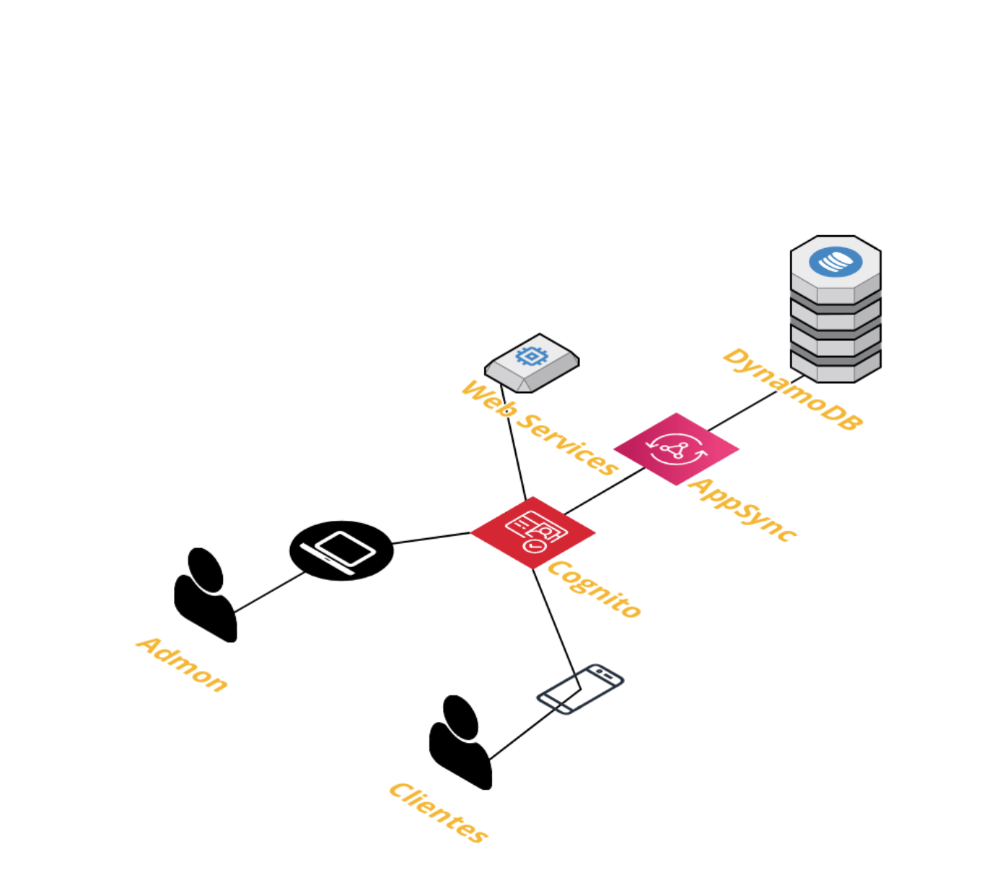
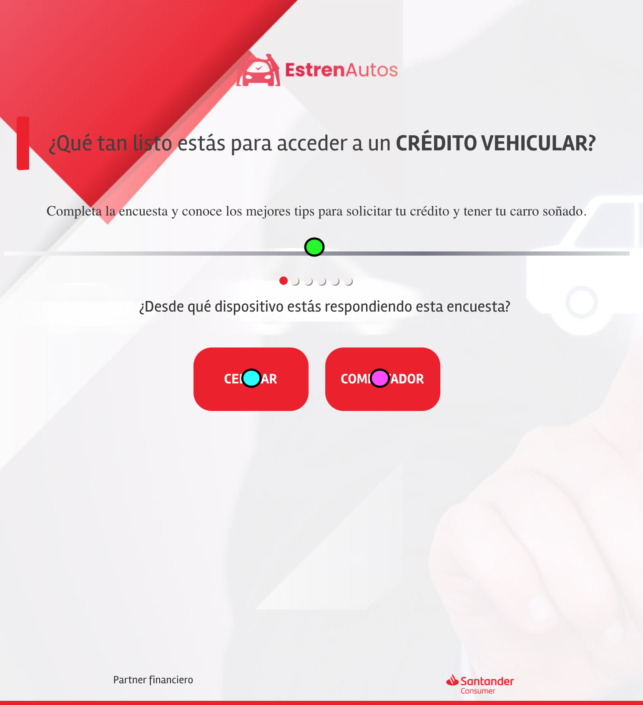
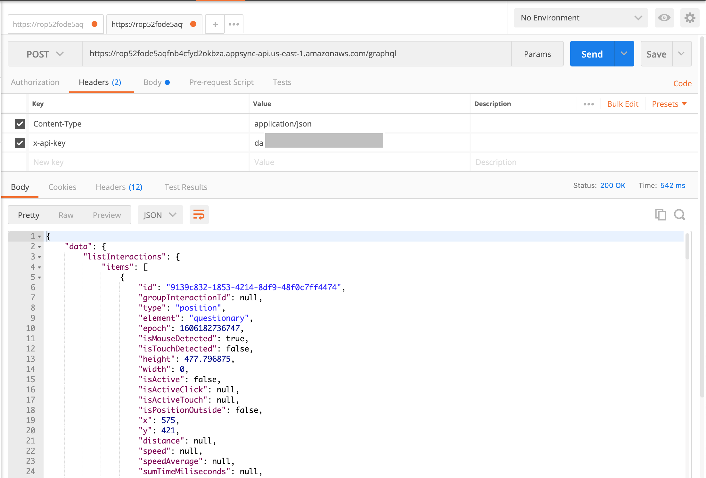
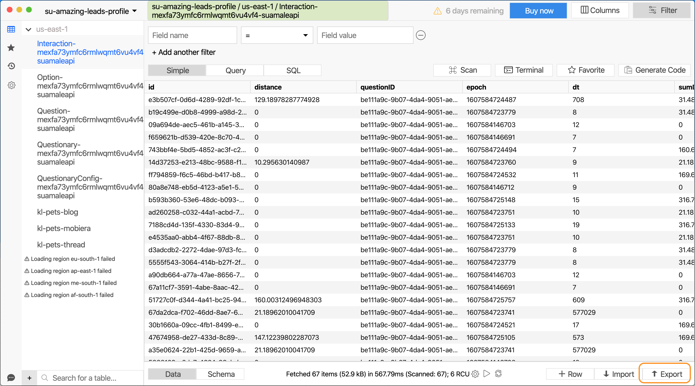

# Architecture
- 
# Event areas interaction
- 
- Blue: questionary area
- Orange: left button
- Green: right button

# Relative Distances

Three distances are calculated:
1. Green: from pointer to center top Questionary
2. Blue: from pointer to right button
3. Pink: from pointer to left button

# KPI
## PC
Every time that the mouse is over an area is calculated:
- dx: (x2 - x1)
- dy: (y2 - y1)
- dt: (t2 - t1)
- distance: Math.sqrt(Math.pow(dx, 2) + Math.pow(dy, 2))
- speed: distance/dt dt != 0
- speedAverage: average per groupInteractionId
- sumTimeMiliseconds: sum time per groupInteractionId
- sumDistance: sum distance per groupInteractionId
- countOutside: count by in/out any area (blue, orange or green)
- distance_questionary_point
- distance_left_button_point 
- distance_right_button_point
- sumTimeMilisecondsBeforeNextQuestion: sum miliseconds before click next question

## Mobile
Every time that the mouse has a tap action is calculated:
- dx: (x2 - x1)
- dy: (y2 - y1)
- dt: (t2 - t1)
- distance: Math.sqrt(Math.pow(dx, 2) + Math.pow(dy, 2))
- speed: distance/dt dt != 0
- speedAverage: average per groupInteractionId
- sumTimeMiliseconds: sum time per groupInteractionId
- sumDistance: sum distance per groupInteractionId


# AppSync - GraphQL - API

## Using Postman

- Link: https://rop52fode5aqfnb4cfyd2okbza.appsync-api.us-east-1.amazonaws.com/graphql
- api key: shared in email

### Query for ListInteractions
```json
{"query":"query ListInteractions($filter: ModelInteractionFilterInput, $limit: Int, $nextToken: String) {\n  listInteractions(filter: $filter, limit: $limit, nextToken: $nextToken) {\n    items {\n      id\n      groupInteractionId\n      type\n      element\n      epoch\n      isMouseDetected\n      isTouchDetected\n      height\n      width\n      isActive\n      isActiveClick\n      isActiveTouch\n      isPositionOutside\n      x\n      y\n      distance\n      speed\n      speedAverage\n      sumTimeMiliseconds\n      dt\n      sumDistance\n      countOutside\n      distance_questionary_point\n      distance_left_button_point\n      distance_right_button_point\n      sumTimeMilisecondsBeforeNextQuestion\n      questionID\n      question {\n        id\n        question\n        question_start_time\n        question_end_time\n        questionaryID\n      }\n    }\n    nextToken\n  }\n}\n","variables":{"authMode":"API_KEY"}}
```

## Using AWS AppSync Console

- [AWS Console link: ](https://shiftactive.signin.aws.amazon.com/console)
- User: su-amazing-leads
- Password: shared in email
- [Queries examples](./../10_APPSYNC/README.md)

## Using CLI
- [Install and Configure CLI](https://docs.aws.amazon.com/cli/latest/userguide/install-cliv2.html)
- [How to configure new profiles](http://docs.aws.amazon.com/cli/latest/userguide/cli-chap-getting-started.html)

### Add new profile
```sh
sudo aws configure --profile new_profile
```
### Using profiles
 - [cli Multiple Profiles](https://docs.aws.amazon.com/cli/latest/userguide/cli-multiple-profiles.html)
```sh
# Single commands
aws ec2 describe-instances --profile new_profile
# or for multiples commands
$ export AWS_PROFILE=new_profile
```

### Scan dynamodb Table
- Tab-separated values (.tsv)
```sh
aws dynamodb scan \
    --table-name Interaction-mexfa73ymfc6rmlwqmt6vu4vf4-suamaleapi \
    --query "Items[*].[id.S, __typename.S, countOutside.N, createdAt.S, distance.N, distance_left_button_point.N, distance_questionary_point.N, distance_right_button_point.N, dt.N, element.S, epoch.N, height.N, isMouseDetected.BOOL, isPositionOutside.BOOL, isTouchDetected.BOOL, questionID.S, questionaryInteractionID.S, speed.N, speedAverage.N, sumDistance.N, sumTimeMiliseconds.N, sumTimeMilisecondsBeforeNextQuestion.N, type.S, updatedAt.S, width.N, x.N, y.N]" \
    --filter-expression 'type = :val' \
    --expression-attribute-values '{":val": {"S": "position"}}' \
    --output text > InteractionsDataDump.tsv

```
## Using Dynobase
- It use the aws configuration
- [Dynobase](https://dynobase.dev/)
- 


# Testing
- [Development Link](https://master.ds3q4dungfi7s.amplifyapp.com/)
