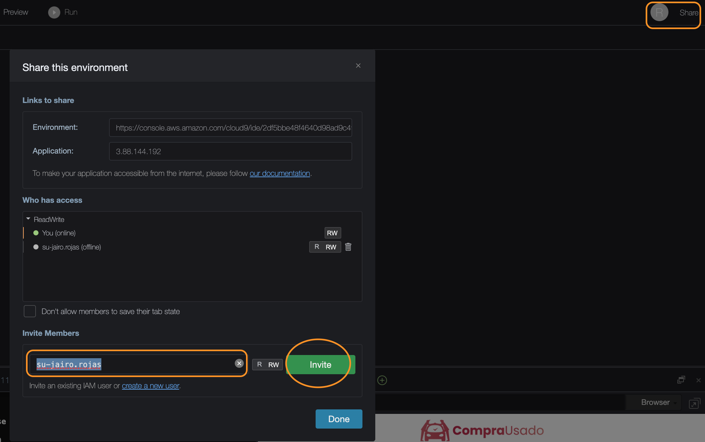

# References
- [Check os version in Linux](https://www.cyberciti.biz/faq/how-to-check-os-version-in-linux-command-line/)
- [Using the AWS Cloud9 IDE with the Dow Jones Education React Tutorial](https://github.com/dowjones/react-tutorial/blob/master/AWS.Cloud9.Instructions.md)

# Linux Distro
```sh
uname -r
4.14.209-160.339.amzn2.x86_64
```

# Clone

```sh
git clone https://git-codecommit.us-east-1.amazonaws.com/v1/repos/su-amazing-leads-roisense
npm install
```

# Invite
