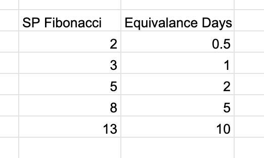

# su-amazing-leads-inception

# Contacto principal
Mauricio Savogal
Llegar a cliente final

# Cursos de IA 
- Producto enigma@Israel (operacion en Australia)
- Modelos y respuestas de comportamiento
- Medios direccionados a formularios para la creación de Leads que va hacia el cliente

# Problema
- Cierre no efectivos
- Ecuador, EU y Bolivia

# Formulario n preguntas
- Interactivos
- Preguntas dicotomicas (si/no)
- Preguntas de testeo

# Seguridad de la informaciòn


# Arquitectura
[Arquitectura (Serverless/RESTful API](00_ARQUITECTURA/README.md)

# Templates
[Uso de plantillas](01_TEMPLATES/README.md)

# Tracking
[Caputura de moviv](02_TRACKING/README.md)


# Requerimientos Iniciales

Proyecto: Amazing Leads
Entorno: Web
Perfiles de Interacción
Super Administrador
1. Creación y Edición de Clientes de la plataforma
2. Visualización de Formularios por Cliente
3. Visualización de Datos registrados por Formulario
Cliente
1. Administrar Perfil de la Cuenta
2. Creación del Landing con su formulario y Configuración (La Idea es que el cliente ejecute direccionamientos de SubDominios)
      Esta construcción de los Landings y Formulario no la imaginamos muy Drag and Drop .
3. El Cliente puede ver la información de los registros del formulario y podra exportarla en csv
Asociado a la información que envía el formulario.
  - Datos Explícitos diligenciados por el usuario.
  ## Comportamientos
   - Si el Usuario esta en Desktop o Mobile
   - Tiempo Total de respuesta del formulario
   - Tiempo Disgregado por Pregunta
   - Cantidad de Clic o Touch en Pantalla
   - Tiempo "Over" sobre los botones
   - Detectar si esta escribiendo en Mayúscula o Minúscula
   - IP
1. Debemos contemplar de forma abstracta un disparador que nos permita enviar la infromación a terceros al momento de recibir un formulario (Sea tanto a plataformas de Machine Learning como a terceros como Call Center CRM etc)
   Entiendo que esto puede variar acorde a la integración pero pensemos como abstractamente podemos construir estos disparadores.
Lo Ideal es tener un Presupuesto Inicial para ir buscando la Viabilidad.

# Costos Estimados
- 
- 

```json
{
  "id": "1",
  "isCreateInteraction": false,
  "isCreateInteractionQuestionary": false,
  "isCreateInteractionQuestionaryButton": false,
  "isShowReactCursorPositionLabel": false,
  "layout": "none"
}
```